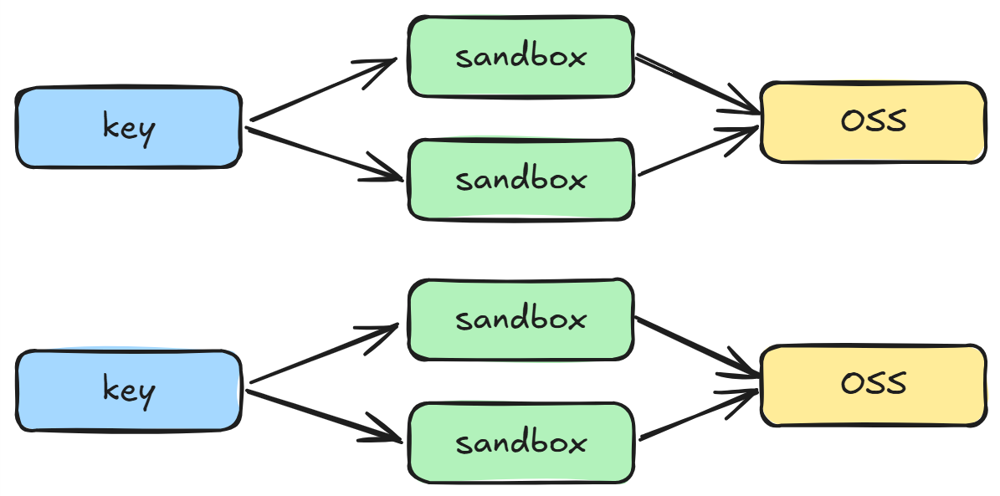

沙箱是隔离的代码执行环境：在受限的进程、容器或虚拟机中运行程序，使文件系统、网络与权限与宿主分离，降低不可信代码或模型生成命令对宿主的影响。Agent 调用 Shell、安装依赖、读写工作区时，执行落点决定隔离强度。本篇说明进程、容器、虚拟机与微虚拟机四类方案，以及对应的底层运行时与上层托管平台，并以兼容 E2B 协议的云沙箱完成生命周期管理、文件与命令操作、对象存储挂载和一次前端项目构建。

Agent底层逻辑第17章的 Harness Engineering 把文件系统、测试命令与权限列为模型外面的环境；沙箱把这些动作放到隔离运行时中执行。第06章将「可选沙箱与代码执行」列为 Deep Agents 的执行环境；第07章的 `FilesystemBackend` 写本机磁盘，第05章的 `ShellToolMiddleware` 提供持久 Shell。二者在本机执行时，隔离取决于操作系统配置。本篇给出隔离方案，并以 E2B 作为托管沙箱的落地方式。

文档：[E2B](https://e2b.dev/docs) · [阿里云函数计算](https://www.aliyun.com/product/fc) · [地域与可用区](https://help.aliyun.com/zh/ecs/user-guide/regions-and-zones)

| 概念                                            | 作用                                                                        |
| ----------------------------------------------- | --------------------------------------------------------------------------- |
| 沙箱                                            | 隔离的代码执行环境，限制进程可见的资源与系统调用                            |
| Process / Container / Virtual Machine / MicroVM | 四类隔离方案，隔离强度与逃逸代价依次上升                                    |
| Firecracker                                     | 微虚拟机监控器，以精简设备模型启动带独立内核的 MicroVM                      |
| E2B                                             | 云沙箱平台。通过 SDK / API 托管 MicroVM，阿里云、腾讯云、AWS 通常兼容其协议 |
| `AsyncSandbox`                                  | E2B 异步客户端。创建、连接、销毁沙箱，并提供文件与命令接口                  |
| `timeout`                                       | 自创建时刻起的存活时限，到期自动销毁                                        |
| `set_timeout`                                   | 从调用时刻重新起算存活时限                                                  |

## 实现沙箱的技术方案

| 方案            | 原理                                       | 隔离性               | 逃逸风险                   | 适用场景                       |
| --------------- | ------------------------------------------ | -------------------- | -------------------------- | ------------------------------ |
| Process         | 通过操作系统的进程权限和资源限制约束程序   | 取决于配置           | 较高，进程漏洞可能影响宿主 | 本地开发、运行低风险代码       |
| Container       | 通过命名空间和控制组隔离进程与限制资源     | 中等，与宿主共享内核 | 中等，内核漏洞可能导致逃逸 | 应用部署、运行受控的第三方代码 |
| Virtual Machine | 通过虚拟化硬件运行独立的完整操作系统       | 高，拥有独立内核     | 较低，需要突破虚拟化边界   | 强隔离、多租户、运行不可信代码 |
| MicroVM         | 通过精简设备模型运行轻量级虚拟机和独立内核 | 高，拥有独立内核     | 较低，需要突破虚拟化边界   | Serverless、AI Agent 代码执行  |

> **说明：** AI Agent 代码执行通常采用 MicroVM：隔离性接近虚拟机，启动开销低于完整虚拟机。本篇后续的 E2B 构建在 Firecracker MicroVM 之上。

## 技术实现

### 底层技术实现

| 名称         | 对应方案        | 定位           | 描述                                        |
| ------------ | --------------- | -------------- | ------------------------------------------- |
| sandbox-exec | Process         | 进程沙箱工具   | 使用 macOS 的系统策略限制进程可以访问的资源 |
| Docker       | Container       | 容器运行平台   | 创建和管理基于操作系统内核隔离的容器        |
| KVM          | Virtual Machine | 虚拟化基础设施 | 利用 Linux 内核提供硬件虚拟化能力           |
| VMware       | Virtual Machine | 虚拟化平台     | 创建和管理运行完整操作系统的虚拟机          |
| Firecracker  | MicroVM         | 微虚拟机监控器 | 创建启动快速、设备模型精简的微虚拟机        |

### 上层技术实现

上层实现封装底层隔离技术，通过统一的 SDK 和 API 提供沙箱能力。

| 名称                | 定位         | 底层支持的技术方案                  | 描述                                                  |
| ------------------- | ------------ | ----------------------------------- | ----------------------------------------------------- |
| E2B                 | 云沙箱平台   | MicroVM（Firecracker）              | 通过 SDK 和 API 为 AI Agent 提供托管沙箱              |
| OpenSandbox         | 开源沙箱框架 | Container、Virtual Machine、MicroVM | 统一管理 Docker 或 Kubernetes 中的多种沙箱运行时      |
| CubeSandbox         | 开源沙箱平台 | MicroVM（KVM、RustVMM）             | 提供面向 AI Agent 的高性能微虚拟机沙箱                |
| LangSmith Sandboxes | 托管沙箱平台 | MicroVM（自托管环境需要 KVM）       | 通过 LangSmith SDK 创建和管理隔离的开发环境           |
| 云服务              | 托管沙箱平台 | MicroVM                             | 阿里云、腾讯云、AWS 均提供托管沙箱，通常兼容 E2B 协议 |

## 安装

```bash
uv add e2b
```

## 沙箱配置

`langchain_project/core/config.py`：在第01章的配置上增加 `SandboxSettings`，从 `.env` 读取兼容 E2B 的接入参数与 OSS 挂载信息。

```python
class SandboxSettings(BaseSettingsWithEnv):
  api_key: str = ""
  api_url: str = ""
  domain: str = ""
  template: str = ""
  oss_bucket: str = ""
  oss_endpoint: str = ""
  role_arn: str = ""

  model_config = {"env_prefix": "E2B_"}

sandbox_settings = SandboxSettings()
```

`.env.example` 追加：

```env
# Sandbox（E2B 兼容平台）
E2B_API_KEY=
E2B_API_URL=
E2B_DOMAIN=
E2B_TEMPLATE=
E2B_OSS_BUCKET=
E2B_OSS_ENDPOINT=
E2B_ROLE_ARN=
```

> **说明：** `api_url` 与 `domain` 指向兼容 E2B 的托管端点（本例为阿里云函数计算沙箱）；官方 E2B Cloud 可省略二者，仅提供 `api_key`。创建沙箱时，`api_url` 与 OSS `endpoint` 须属于同一地域。

## 沙箱管理

后续示例运行于异步上下文。先准备公共参数，再创建、连接、延长存活时间并销毁。

```python
from e2b import AsyncSandbox
from langchain_project.core.config import sandbox_settings

basic_config = {
  "timeout": 300,  # 自创建时刻起计时，到期自动销毁
  "api_key": sandbox_settings.api_key,
  "api_url": sandbox_settings.api_url,
  "domain": sandbox_settings.domain,
}
```

`template` 指定沙箱镜像；镜像中预装的运行时决定后续命令能否执行。

### 创建沙箱

```python
sandbox = await AsyncSandbox.create(
  template=sandbox_settings.template,
  **basic_config,
)
sandbox.sandbox_id
```


### 连接已有沙箱

```python
sandbox = await AsyncSandbox.connect(
  sandbox_id=sandbox.sandbox_id,
  **basic_config,
)
sandbox.sandbox_id
```

### 手动刷新超时

```python
await sandbox.set_timeout(300)  # 从当前时刻重新计时 300 秒后销毁
```

> **说明：** 长步骤（安装依赖、构建）前调用 `set_timeout`，将销毁倒计时从当前时刻重新起算，避免执行中途被回收。

### 手动销毁沙箱

```python
await sandbox.kill()
```

## 沙箱操作

重新创建沙箱后演示文件与命令。下列操作共用同一实例。

```python
sandbox = await AsyncSandbox.create(
  template=sandbox_settings.template,
  **basic_config,
)
```

### 文件读写

```python
file_path = "/home/user/workspace/test.txt"
await sandbox.set_timeout(300)
await sandbox.files.write(file_path, "Hello World!")

await sandbox.set_timeout(300)
await sandbox.files.read(file_path)
```


### 命令执行

```python
await sandbox.set_timeout(300)
await sandbox.commands.run("node --version") # CommandResult(stderr='', stdout='v20.20.2\n', exit_code=0, error='')

await sandbox.set_timeout(300)
await sandbox.commands.run("npm init -y", cwd="/home/user/workspace")

await sandbox.set_timeout(300)
await sandbox.commands.run("ls", cwd="/home/user/workspace", timeout=60)
```

`commands.run` 的 `timeout` 是单条命令的执行时限，与沙箱存活时限 `set_timeout` 不是同一参数。

## 挂载 OSS

阿里云函数计算沙箱通过创建参数中的 `metadata` 将对象存储挂到沙箱内目录：`fc.sandbox.storage.oss` 描述挂载点，`fc.sandbox.auth.role` 指定访问桶所用的角色。该扩展不属于 E2B 开源 SDK 的通用参数。

```python
import json

metadata_config = {
  "metadata": {
    "fc.sandbox.storage.oss": json.dumps({
      "mountPoints": [
        {
          "bucketName": sandbox_settings.oss_bucket,
          "mountDir": "/home/user/workspace",
          "bucketPath": "/e2b-test/workspace",
          "endpoint": sandbox_settings.oss_endpoint,
          "readOnly": False,
        },
        {
          "bucketName": sandbox_settings.oss_bucket,
          "mountDir": "/home/user/output",
          "bucketPath": "/e2b-test/output",
          "endpoint": sandbox_settings.oss_endpoint,
          "readOnly": False,
        },
      ]
    }),
    "fc.sandbox.auth.role": sandbox_settings.role_arn,
  }
}
```

每个挂载点把桶内前缀映射到沙箱内目录：`bucketName` + `bucketPath` 是对象存储上的位置，`mountDir` 是沙箱文件系统中的挂载路径。对该目录的读写，等价于对桶内对应前缀的读写。

| 沙箱路径（`mountDir`） | 对象存储位置（`bucketName` / `bucketPath`） |
| ---------------------- | ------------------------------------------- |
| `/home/user/workspace` | `{oss_bucket}/e2b-test/workspace`           |
| `/home/user/output`    | `{oss_bucket}/e2b-test/output`              |

因此 `files.write("/home/user/workspace/source.txt", ...)` 写入的是桶中 `e2b-test/workspace/source.txt`；`files.write("/home/user/output/output.txt", ...)` 写入的是 `e2b-test/output/output.txt`。两个挂载点共用同一只桶，靠 `bucketPath` 前缀分开。子路径保持相对关系：沙箱内 `mountDir` 下的 `a/b.txt`，对应桶内 `bucketPath/a/b.txt`。

创建带挂载的沙箱，并向两个目录写入文件：

```python
sandbox = await AsyncSandbox.create(
  template=sandbox_settings.template,
  **basic_config,
  **metadata_config,
)

await sandbox.set_timeout(300)
await sandbox.files.write("/home/user/workspace/source.txt", "source")
await sandbox.files.write("/home/user/output/output.txt", "output")

await sandbox.kill()
```

销毁后按同一挂载配置重新创建，列出两个目录：

```python
sandbox = await AsyncSandbox.create(
  template=sandbox_settings.template,
  **basic_config,
  **metadata_config,
)

await sandbox.set_timeout(300)
await sandbox.commands.run("ls", cwd="/home/user/workspace")

await sandbox.set_timeout(300)
await sandbox.commands.run("ls", cwd="/home/user/output")
```

工作区与输出目录中的文件仍在，说明内容已写入对象存储，而不是仅存在于被销毁的那次沙箱实例。

## 沙箱实战

使用已挂载 OSS 的沙箱，在工作区初始化 Vite + Vue 项目、安装依赖、写入构建配置、执行构建，并将 `dist` 复制到输出目录。输出目录同样挂载对象存储，构建产物在沙箱销毁后仍可从桶中读取。

```python
sandbox = await AsyncSandbox.create(
  template=sandbox_settings.template,
  **basic_config,
  **metadata_config,
)
```

初始化项目：

```python
await sandbox.set_timeout(300)
await sandbox.commands.run(
  "npm create vite@latest my-vue-app -- --template vue --no-interactive",
  cwd="/home/user/workspace",
)
```

安装依赖：

```python
await sandbox.set_timeout(300)
await sandbox.commands.run(
  "npm i",
  cwd="/home/user/workspace/my-vue-app",
)
```

写入 Vite 配置。`base: ''` 使构建资源使用相对路径，便于从对象存储或任意子路径访问：

```python
await sandbox.files.write("/home/user/workspace/my-vue-app/vite.config.js", """
import vue from '@vitejs/plugin-vue';
import { defineConfig } from 'vite';

// https://vite.dev/config/
export default defineConfig({
  plugins: [vue()],
  base: '',
});
""")
```

构建并将产物复制到输出目录：

```python
await sandbox.set_timeout(300)
await sandbox.commands.run(
  "npm run build",
  cwd="/home/user/workspace/my-vue-app",
)

await sandbox.set_timeout(300)
await sandbox.commands.run(
  "cp -a /home/user/workspace/my-vue-app/dist /home/user/output/my-vue-app",
)

await sandbox.kill()
```

## 沙箱隔离方案

隔离单位是 `key`，不是单次沙箱实例。同一 `key` 可以对应多个先后创建的沙箱（超时销毁后再建），它们挂到同一组 OSS 前缀；不同 `key` 使用不同前缀，工作区互不可见。



`langchain_project/core/sandbox.py`：按 `key` 取得沙箱。两件事分开做：用 LangGraph第26章的 Store 记下该 `key` 当前的 `sandbox_id`，以便复用尚未销毁的实例；把 OSS 的 `bucketPath` 写成 `/{key}/workspace` 与 `/{key}/output`，使文件按 `key` 落盘。未传入 `store` 时使用 `InMemoryStore`。

`get_sandbox` 的流程：解析 `key` 与 `store` → 按 `key` 生成挂载配置 → 从 Store 读取 `sandbox_id`，能 `connect` 则 `set_timeout` 后续期返回 → 否则 `create`，把新的 `sandbox_id` 写入 Store。连接失败（实例已到期）时走创建分支，OSS 前缀不变，上一实例留下的文件仍在。

```python
import json
import uuid

from e2b import AsyncSandbox
from langgraph.store.base import BaseStore
from langgraph.store.memory import InMemoryStore

from langchain_project.core.config import sandbox_settings

TIMEOUT = 300
_STORE_NAMESPACE = ("project",)

basic_config = {
  "timeout": TIMEOUT,  # 自创建时刻起计时，到期自动销毁
  "api_key": sandbox_settings.api_key,
  "api_url": sandbox_settings.api_url,
  "domain": sandbox_settings.domain,
}

def _get_key(key: str | None) -> str:
  if key is None:
    key = str(uuid.uuid4())
  return key

def _get_store(store: BaseStore | None) -> BaseStore:
  if store is None:
    store = InMemoryStore()
  return store

def _get_metadata_config(key: str):
  return {
    "metadata": {
      "fc.sandbox.storage.oss": json.dumps({
        "mountPoints": [
          {
            "bucketName": sandbox_settings.oss_bucket,
            "mountDir": "/home/user/workspace",
            "bucketPath": f"/{key}/workspace",
            "endpoint": sandbox_settings.oss_endpoint,
            "readOnly": False,
          },
          {
            "bucketName": sandbox_settings.oss_bucket,
            "mountDir": "/home/user/output",
            "bucketPath": f"/{key}/output",
            "endpoint": sandbox_settings.oss_endpoint,
            "readOnly": False,
          },
        ]
      }),
      "fc.sandbox.auth.role": sandbox_settings.role_arn,
    }
  }

async def _get_sandbox_id(store: BaseStore, key: str) -> str | None:
  item = await store.aget(_STORE_NAMESPACE, key)
  if not item:
    return None
  if not item.value:
    return None
  return item.value.get("sandbox_id", None)

async def get_sandbox(
  *,
  key: str | None = None,
  store: BaseStore | None = None,
) -> AsyncSandbox:
  """按 key 取得沙箱：能连上则复用，否则新建。"""
  key = _get_key(key)
  store = _get_store(store)
  metadata_config = _get_metadata_config(key)

  sandbox_id = await _get_sandbox_id(store, key)
  if sandbox_id is not None:
    try:
      sandbox = await AsyncSandbox.connect(sandbox_id=sandbox_id, **basic_config)
      await sandbox.set_timeout(TIMEOUT)
      return sandbox
    except Exception:
      pass

  sandbox = await AsyncSandbox.create(
    template=sandbox_settings.template,
    **basic_config,
    **metadata_config,
  )

  await store.aput(_STORE_NAMESPACE, key, {"sandbox_id": sandbox.sandbox_id})
  return sandbox
```

使用

```python
# main.py
from langchain_project.core.sandbox import get_sandbox

sandbox = await get_sandbox(key="e2b-test") # type: ignore

await sandbox.files.write("/home/user/workspace/source.txt", "source") # type: ignore
await sandbox.files.write("/home/user/output/output.txt", "output") # type: ignore
```

