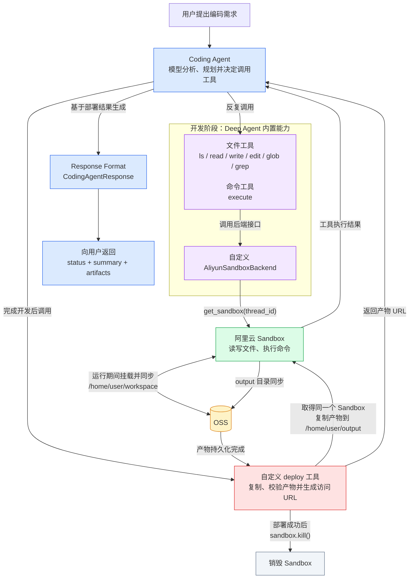

服务端 Coding Agent 面向编码任务：模型规划后反复调用文件与命令工具，在隔离沙箱中编写并构建产物，再通过部署工具把静态文件发布为可访问地址，最后以结构化响应返回状态、摘要与产物入口。本篇实现自定义沙箱后端 `AliyunSandboxBackend`、部署工具 `deploy`，以及带交付边界与 `response_format` 的 Agent 入口。

内部控制流仍是 Agent底层逻辑第10章的 ReAct；工具调用对应第08章的 Tool Calling 与第09章的工具注册与执行。Agent底层逻辑第17章的 Harness Engineering 把文件系统、测试命令与权限列为模型外面的环境；第06章的 `create_deep_agent` 用 `backend` 落地这件事，第07章的 `FilesystemBackend` 写本机磁盘。本篇把后端换成实现 `SandboxBackendProtocol` 的阿里云沙箱，执行落在第08章的隔离运行时中。`thread_id` 对应 LangGraph第07章的线程和检查点、第11章的 RunnableConfig；`get_runtime().store` 对应第12章 Runtime 与第26章 Store。结构化输出同第02章的 `ToolStrategy`。图入口仍是第06章登记的 `coding_agent`，经 Agent Server 部署对应 LangGraph第05章。系统提示词对应 Agent底层逻辑第06章。

文档：[Sandboxes](https://docs.langchain.com/oss/python/deepagents/sandboxes) · [`SandboxBackendProtocol`](https://reference.langchain.com/python/deepagents/backends/protocol/SandboxBackendProtocol) · [`create_deep_agent`](https://reference.langchain.com/python/deepagents/graph/create_deep_agent)

| 概念                     | 作用                                                                                                             |
| ------------------------ | ---------------------------------------------------------------------------------------------------------------- |
| `SandboxBackendProtocol` | 在第07章 `BackendProtocol` 上增加 `id` 与 `execute` / `aexecute`。传入该类后端后，harness 才向模型暴露 `execute` |
| `AliyunSandboxBackend`   | 本篇实现。按 `thread_id` 调用第08章的 `get_sandbox`，把文件与命令操作转到该沙箱                                  |
| `deploy`                 | 自定义工具。把工作区产物复制到 `/home/user/output`，返回入口 URL，并销毁沙箱                                     |
| `CodingAgentResponse`    | 最终结构化响应：`status`、`summary`、`artifacts`                                                                 |
| `ToolStrategy`           | 第02章策略。挂「提交结构化结果」的工具，按 schema 交付                                                           |

## 整体流程

用户提出编码需求后，Agent 在 Deep Agents 默认循环中调用内置文件工具与 `execute`。这些调用不直接接触宿主磁盘，而是经 `AliyunSandboxBackend` 转到第08章按 `thread_id` 取得的阿里云沙箱。工作区 `/home/user/workspace` 与输出目录 `/home/user/output` 在创建时已挂载 OSS：沙箱内读写等价于桶内 `/{thread_id}/workspace` 与 `/{thread_id}/output`。开发完成后 Agent 调用 `deploy`，把产物复制到 output、校验入口文件、返回访问 URL，再 `sandbox.kill()`。最后用 `CodingAgentResponse` 向用户交付。



第07章已说明：工具名不变，更换 `backend` 只更换读写落点。`StateBackend` / `FilesystemBackend` 只提供文件工具；实现 `SandboxBackendProtocol` 后，同一套文件工具之外会多出 `execute`，命令在隔离运行时中执行。

## 实现阿里云沙箱后端

`langchain_project/backends/aliyun_sandbox_backend.py`：实现 `SandboxBackendProtocol`，把 Deep Agents 的文件与命令调用转到第08章的 `get_sandbox`。

Deep Agents 文档中的 `BaseSandbox` 只要求子类实现 `execute`，其余文件操作由基类通过在沙箱内执行脚本完成。本实现直接对接 E2B 的 `files` / `commands` 接口，自行实现协议方法，不经过 `BaseSandbox`。

隔离单位与第08章相同：`id` 取 `configurable.thread_id`，`_get_sandbox` 以该值作为 `key` 调用 `get_sandbox`，并用 `get_runtime().store` 复用尚未销毁的实例。缺少 `thread_id` 或 runtime store 时直接报错，因此应经 Agent Server / Studio 调用，而不是在未注入配置的情况下直接 `invoke`。

`_sandbox_operation` 在每次操作前后调用 `set_timeout(TIMEOUT)`，把销毁倒计时从当前时刻重新起算，对应第08章「长步骤前刷新存活时限」。`aexecute` 的 `timeout` 是单条命令的执行时限，默认 60 秒，与沙箱存活时限不是同一参数；工作目录固定为 `/home/user/workspace`。

| 工具         | 后端方法   |
| ------------ | ---------- |
| `ls`         | `als`      |
| `read_file`  | `aread`    |
| `write_file` | `awrite`   |
| `edit_file`  | `aedit`    |
| `delete`     | `adelete`  |
| `glob`       | `aglob`    |
| `grep`       | `agrep`    |
| `execute`    | `aexecute` |

`aread` 先按字节读取：能按 UTF-8 解码则经 `slice_read_response` 分页返回，对应第07章 `read_file` 的按行分页；否则以 base64 返回。`agrep` 按字面文本匹配，不是正则，与第07章一致。`aedit` 先读全文，再用 `perform_string_replacement` 做精确替换后写回。

```python
import asyncio
import base64
from collections.abc import AsyncIterator
from contextlib import asynccontextmanager

from deepagents.backends.protocol import (
  DeleteResult,
  EditResult,
  ExecuteResponse,
  FileDownloadResponse,
  FileInfo,
  FileUploadResponse,
  GlobResult,
  GrepMatch,
  GrepResult,
  LsResult,
  ReadResult,
  SandboxBackendProtocol,
  WriteResult,
)
from deepagents.backends.utils import (
  compile_grep_include_glob,
  compile_recursive_glob,
  perform_string_replacement,
  slice_read_response,
)
from e2b import AsyncSandbox
from e2b.exceptions import FileNotFoundException
from e2b.sandbox.filesystem.filesystem import EntryInfo, FileType
from langgraph.config import get_config
from langgraph.runtime import get_runtime

from langchain_project.core.sandbox import TIMEOUT, get_sandbox

WORKSPACE_DIR = "/home/user/workspace"

def _entry_to_file_info(entry: EntryInfo) -> FileInfo:
  return {
    "path": entry.path,
    "is_dir": entry.type == FileType.DIR,
    "size": entry.size,
    "modified_at": entry.modified_time.isoformat(),
  }

class AliyunSandboxBackend(SandboxBackendProtocol):
  """Async-only Deep Agents backend backed by the project's Aliyun sandbox."""

  @property
  def id(self) -> str:
    thread_id = get_config().get("configurable", {}).get("thread_id")
    if thread_id is None:
      msg = "AliyunSandboxBackend requires configurable.thread_id"
      raise RuntimeError(msg)
    return str(thread_id)

  async def _get_sandbox(self) -> AsyncSandbox:
    store = get_runtime().store
    if store is None:
      msg = "AliyunSandboxBackend requires a runtime store"
      raise RuntimeError(msg)
    return await get_sandbox(key=self.id, store=store)

  @asynccontextmanager
  async def _sandbox_operation(self) -> AsyncIterator[AsyncSandbox]:
    sandbox = await self._get_sandbox()
    await sandbox.set_timeout(TIMEOUT)
    try:
      yield sandbox
    finally:
      await sandbox.set_timeout(TIMEOUT)

  async def aexecute(
    self,
    command: str,
    *,
    timeout: int | None = 60,
  ) -> ExecuteResponse:
    try:
      async with self._sandbox_operation() as sandbox:
        result = await sandbox.commands.run(
          command,
          cwd=WORKSPACE_DIR,
          timeout=timeout if timeout is not None else 60,
        )
      return ExecuteResponse(
        output=result.stdout + result.stderr,
        exit_code=result.exit_code,
      )
    except Exception as exc:
      return ExecuteResponse(
        output=f"Error executing command: {exc}",
        exit_code=1,
      )

  async def als(self, path: str) -> LsResult:
    try:
      async with self._sandbox_operation() as sandbox:
        entries = await sandbox.files.list(path, depth=1)
      return LsResult(entries=[_entry_to_file_info(entry) for entry in entries])
    except Exception as exc:
      return LsResult(error=f"Error listing directory {path!r}: {exc}")

  async def aread(
    self,
    file_path: str,
    offset: int = 0,
    limit: int = 2000,
  ) -> ReadResult:
    try:
      async with self._sandbox_operation() as sandbox:
        content = bytes(
          await sandbox.files.read(
            file_path,
            format="bytes",
          )
        )
    except Exception as exc:
      return ReadResult(error=f"Error reading file {file_path!r}: {exc}")

    try:
      text = content.decode("utf-8")
    except UnicodeDecodeError:
      return ReadResult(
        file_data={
          "content": base64.b64encode(content).decode("ascii"),
          "encoding": "base64",
        }
      )

    return slice_read_response(
      {"content": text, "encoding": "utf-8"},
      offset,
      limit,
    )

  async def agrep(
    self,
    pattern: str,
    path: str | None = None,
    glob: str | None = None,
    *,
    max_count: int | None = None,
  ) -> GrepResult:
    search_path = path or "/"
    try:
      include = compile_grep_include_glob(glob) if glob else None
      async with self._sandbox_operation() as sandbox:
        entries = await sandbox.files.list(search_path, depth=None)

        matches: list[GrepMatch] = []
        for entry in entries:
          if entry.type != FileType.FILE:
            continue

          relative_path = entry.path.removeprefix(
            search_path.rstrip("/") + "/"
          ).lstrip("/")
          if include is not None and not include(relative_path):
            continue

          try:
            content = await sandbox.files.read(entry.path, format="text")
          except Exception:
            continue

          for line_number, line in enumerate(content.splitlines(), start=1):
            if pattern not in line:
              continue
            if max_count is not None and len(matches) >= max(max_count, 0):
              return GrepResult(matches=matches, truncated=True)
            matches.append(
              {
                "path": entry.path,
                "line": line_number,
                "text": line,
              }
            )
    except Exception as exc:
      return GrepResult(error=f"Error searching path {search_path!r}: {exc}")

    return GrepResult(matches=matches)

  async def aglob(self, pattern: str, path: str | None = None) -> GlobResult:
    search_path = path or "/"
    try:
      matcher = compile_recursive_glob(pattern)
      async with self._sandbox_operation() as sandbox:
        entries = await sandbox.files.list(search_path, depth=None)
    except Exception as exc:
      return GlobResult(error=f"Error globbing path {search_path!r}: {exc}")

    matches: list[FileInfo] = []
    for entry in entries:
      if entry.type != FileType.FILE:
        continue
      relative_path = entry.path.removeprefix(
        search_path.rstrip("/") + "/"
      ).lstrip("/")
      if matcher(relative_path):
        matches.append(_entry_to_file_info(entry))
    return GlobResult(matches=matches)

  async def awrite(self, file_path: str, content: str) -> WriteResult:
    try:
      async with self._sandbox_operation() as sandbox:
        await sandbox.files.write(file_path, content)
      return WriteResult(path=file_path)
    except Exception as exc:
      return WriteResult(error=f"Error writing file {file_path!r}: {exc}")

  async def aedit(
    self,
    file_path: str,
    old_string: str,
    new_string: str,
    replace_all: bool = False,
  ) -> EditResult:
    try:
      async with self._sandbox_operation() as sandbox:
        content = await sandbox.files.read(file_path, format="text")
        replacement = perform_string_replacement(
          content,
          old_string,
          new_string,
          replace_all,
        )
        if isinstance(replacement, str):
          return EditResult(error=replacement)

        new_content, occurrences = replacement
        await sandbox.files.write(file_path, new_content)
      return EditResult(path=file_path, occurrences=occurrences)
    except Exception as exc:
      return EditResult(error=f"Error editing file {file_path!r}: {exc}")

  async def aupload_files(
    self,
    files: list[tuple[str, bytes]],
  ) -> list[FileUploadResponse]:
    async with self._sandbox_operation() as sandbox:
      async def upload(file_path: str, content: bytes) -> FileUploadResponse:
        try:
          await sandbox.files.write(file_path, content)
          return FileUploadResponse(path=file_path)
        except Exception as exc:
          return FileUploadResponse(path=file_path, error=str(exc))

      return list(
        await asyncio.gather(
          *(upload(file_path, content) for file_path, content in files)
        )
      )

  async def adownload_files(
    self,
    paths: list[str],
  ) -> list[FileDownloadResponse]:
    async with self._sandbox_operation() as sandbox:
      async def download(file_path: str) -> FileDownloadResponse:
        try:
          content = bytes(
            await sandbox.files.read(
              file_path,
              format="bytes",
            )
          )
          return FileDownloadResponse(path=file_path, content=content)
        except FileNotFoundException:
          return FileDownloadResponse(path=file_path, error="file_not_found")
        except Exception as exc:
          return FileDownloadResponse(path=file_path, error=str(exc))

      return list(await asyncio.gather(*(download(path) for path in paths)))

  async def adelete(self, file_path: str) -> DeleteResult:
    try:
      async with self._sandbox_operation() as sandbox:
        if not await sandbox.files.exists(file_path):
          return DeleteResult(error=f"Error: File {file_path!r} not found")
        await sandbox.files.remove(file_path)
      return DeleteResult(path=file_path)
    except Exception as exc:
      return DeleteResult(error=f"Error deleting {file_path!r}: {exc}")
```

`langchain_project/backends/__init__.py`：导出 `AliyunSandboxBackend`，供入口按包名 `from langchain_project.backends import AliyunSandboxBackend` 导入。

```python
from .aliyun_sandbox_backend import AliyunSandboxBackend

__all__ = ["AliyunSandboxBackend"]
```

## 部署工具

`langchain_project/tools/deploy.py`：自定义工具，把沙箱内已检查或构建完成的文件/目录复制到 `/home/user/output/<target_dirname>/`，校验入口文件后返回公开 URL，并销毁当前沙箱实例。

平台只提供静态资源部署。`path` 指向工作区中的产物（文件或目录），`target_dirname` 为对象存储上的目标目录名，`entry_files` 为该目录内的相对入口路径。output 在第08章已挂载 OSS，复制完成即写入 `/{thread_id}/output/<target_dirname>/`。公开地址按同一前缀拼接：`{PUBLIC_BASE_URL}/{thread_id}/output/{target_dirname}/{entry_file}`。

复制采用临时目录再 `mv` 替换：先写入 `<destination>.deploying`，成功后再替换正式目录，避免半成品成为线上内容。`entry_files` 必须能在替换后的目录中找到，否则抛出 `ToolException`。`handle_tool_error = True` 把这类异常转为模型可理解的错误工具消息，便于修正 `path` 或 `entry_files` 后重试。

部署成功后调用 `sandbox.kill()`。实例销毁，OSS 上的 output 仍在；Store 里仍记着旧的 `sandbox_id`，下次 `get_sandbox` 会因 `connect` 失败而新建，OSS 前缀不变。模型拿到 URL 后即可提交 `CodingAgentResponse`，后续不再需要该沙箱实例。

```python
import posixpath
import shlex
from urllib.parse import quote

from langchain.tools import tool
from langchain_core.tools import ToolException
from langgraph.config import get_config
from langgraph.runtime import get_runtime
from pydantic import BaseModel, Field, field_validator

from langchain_project.core.sandbox import get_sandbox

OUTPUT_DIR = "/home/user/output"
PUBLIC_BASE_URL = "http://duyi-course.yuanjin.tech"

class DeployInput(BaseModel):
  path: str = Field(
    description="沙箱内的产物路径，它可以是文件夹，也可以是文件。\n"
    "这些路径表示要最终交付给用户的产物。\n"
    "比如："
    '"/home/user/workspace/my-vue-app/dist"\n'
    '"/home/user/workspace/my-vue-app/assets/charts.png"\n'
    '"/home/user/workspace/my-vue-app/other.tar.gz"\n'
    "如果指定的是目录，该工具会自动递归读取该目录下的所有文件进行部署"
  )
  target_dirname: str = Field(
    description="部署的目标目录名称。\n"
    "该工具会把path指定的产物放到云存储的某个存储路径中。\n"
    "存储路径是： <前缀>/<target_dirname>/。"
    "前缀是什么你无需关心，你只需要指定target_dirname即可。\n"
    "建议该值直接取用workspace中的工程名字"
  )
  entry_files: list[str] = Field(
    min_length=1,
    description="指定部署完成过后，要访问的入口文件名称。\n"
    '比如：["index.html"、"chart.png"]',
  )

  @field_validator("path")
  @classmethod
  def validate_path(cls, path: str) -> str:
    path = posixpath.normpath(path.strip())
    if not path.startswith("/"):
      raise ValueError("path必须是沙箱内的绝对路径")
    if path == OUTPUT_DIR or path.startswith(f"{OUTPUT_DIR}/"):
      raise ValueError("path不能位于部署输出目录中")
    return path

  @field_validator("target_dirname")
  @classmethod
  def validate_target_dirname(cls, target_dirname: str) -> str:
    target_dirname = target_dirname.strip()
    if (
      not target_dirname
      or target_dirname in {".", ".."}
      or "/" in target_dirname
      or "\\" in target_dirname
    ):
      raise ValueError("target_dirname必须是单个安全的目录名")
    return target_dirname

  @field_validator("entry_files")
  @classmethod
  def validate_entry_files(cls, entry_files: list[str]) -> list[str]:
    normalized: list[str] = []
    for entry_file in entry_files:
      entry_file = entry_file.strip()
      normalized_entry = posixpath.normpath(entry_file)
      if (
        not entry_file
        or normalized_entry in {".", ".."}
        or normalized_entry.startswith("../")
        or normalized_entry.startswith("/")
        or "\\" in normalized_entry
      ):
        raise ValueError("entry_files只能包含目标目录内的相对路径")
      normalized.append(normalized_entry)

    if len(normalized) != len(set(normalized)):
      raise ValueError("entry_files不能重复")
    return normalized

def _public_url(thread_id: str, target_dirname: str, entry_file: str) -> str:
  encoded_entry = "/".join(quote(part, safe="") for part in entry_file.split("/"))
  return (
    f"{PUBLIC_BASE_URL}/{quote(thread_id, safe='')}/output/"
    f"{quote(target_dirname, safe='')}/{encoded_entry}"
  )

@tool(args_schema=DeployInput)
async def deploy(
  path: str,
  target_dirname: str,
  entry_files: list[str],
) -> list[str]:
  """
  把沙箱内的文件或目录部署到云存储，并返回入口文件的访问地址。

  调用示例：
  deploy(
    path="/home/user/workspace/my-vue-app/dist",
    target_dirname="my-vue-app",
    entry_files=["index.html"]
  )

  返回示例：
  [
    "https://deploy.com/a2e9d7d8/output/my-vue-app/index.html"
  ]
  """
  thread_id = get_config().get("configurable", {}).get("thread_id")
  if thread_id is None:
    raise RuntimeError("部署工具需要configurable.thread_id")

  store = get_runtime().store
  if store is None:
    raise RuntimeError("部署工具需要runtime store")

  sandbox = await get_sandbox(key=str(thread_id), store=store)
  if not await sandbox.files.exists(path):
    raise ToolException(f"待部署的产物不存在，请检查path后重试: {path}")

  destination = posixpath.join(OUTPUT_DIR, target_dirname)
  temporary_destination = f"{destination}.deploying"
  quoted_path = shlex.quote(path)
  quoted_destination = shlex.quote(destination)
  quoted_temporary = shlex.quote(temporary_destination)
  command = (
    "set -eu\n"
    f"rm -rf -- {quoted_temporary}\n"
    f"mkdir -p -- {quoted_temporary}\n"
    f"if [ -d {quoted_path} ]; then\n"
    f"  cp -R -- {quoted_path}/. {quoted_temporary}/\n"
    "else\n"
    f"  cp -- {quoted_path} {quoted_temporary}/\n"
    "fi\n"
    f"rm -rf -- {quoted_destination}\n"
    f"mv -- {quoted_temporary} {quoted_destination}"
  )
  result = await sandbox.commands.run(command, timeout=300)
  if result.exit_code != 0:
    detail = (result.stderr or result.stdout).strip()
    raise ToolException(
      f"部署产物失败，请检查产物路径和内容后重试: {detail or '未知错误'}"
    )

  missing_entries = [
    entry_file
    for entry_file in entry_files
    if not await sandbox.files.exists(posixpath.join(destination, entry_file))
  ]
  if missing_entries:
    raise ToolException(
      "部署后找不到入口文件，请修正entry_files后重试: "
      + ", ".join(missing_entries)
    )

  public_urls = [
    _public_url(str(thread_id), target_dirname, entry_file)
    for entry_file in entry_files
  ]
  await sandbox.kill()
  return public_urls

deploy.handle_tool_error = True
```

## Coding Agent 入口

`langchain_project/agents/coding_agent.py`：在第06、第07章的 Deep Agent 入口上，把 `backend` 换成 `AliyunSandboxBackend()`，并加上系统提示词与结构化输出。`tools` 与前几章同一列表，须包含上一节的 `deploy`。

`CodingAgentResponse` 约束最终交付形状：`completed` 必须带至少一个已部署产物；`cannot_deliver` 的 `artifacts` 必须为空。`ToolStrategy` 挂提交该 schema 的工具，与第02章相同。

系统提示词划定交付边界：平台只能部署静态文件（HTML、CSS、JavaScript、图片、配置，或可构建为静态文件的前端工程）。沙箱可以编写、构建并临时运行后端，但平台没有后端部署能力；依赖 API、数据库、身份认证、定时任务或常驻进程的需求应直接说明无法交付，且不得把该限制说成沙箱没有后端开发能力。工程建在 `/home/user/workspace` 的独立子目录中。静态资源须使用相对路径（Vite 将 `base` 设为 `"./"`），否则部署到多层子目录后无法加载。每次交付都必须先成功调用 `deploy`，再把返回的访问地址写入最终响应。

```python
from typing import Literal, Self

from deepagents import create_deep_agent
from langchain.agents.structured_output import ToolStrategy
from langchain.chat_models import init_chat_model
from pydantic import BaseModel, Field, model_validator

from langchain_project.core.config import anthropic_settings
from langchain_project.tools import tools
from langchain_project.backends import AliyunSandboxBackend

class DeployedArtifact(BaseModel):
  """已通过deploy工具部署的一个产物入口。"""

  name: str = Field(description="产物名称，例如首页或源码压缩包")
  mime_type: str = Field(
    description="产物的MIME类型，例如text/html、image/png或application/gzip"
  )
  url: str = Field(description="deploy工具返回的产物访问地址")

class CodingAgentResponse(BaseModel):
  """Coding Agent交付给用户的最终结构化响应。"""

  status: Literal["completed", "cannot_deliver"] = Field(
    description=(
      "已完成并部署产物时使用completed；"
      "需求超出平台交付能力时使用cannot_deliver"
    )
  )
  summary: str = Field(description="向用户说明完成内容或无法交付原因的简要总结")
  artifacts: list[DeployedArtifact] = Field(
    default_factory=list,
    description="deploy工具返回的全部产物入口；无法交付时为空列表",
  )

  @model_validator(mode="after")
  def validate_artifacts(self) -> Self:
    if self.status == "completed" and not self.artifacts:
      raise ValueError("completed响应必须包含至少一个已部署产物")
    if self.status == "cannot_deliver" and self.artifacts:
      raise ValueError("cannot_deliver响应不应包含已部署产物")
    return self

model = init_chat_model(
  model=anthropic_settings.default_model,
  model_provider="anthropic",
  thinking={"type": "disabled"},
)

system_prompt = """# 角色

你是一个专门用于编写代码的 Agent。

# 产物交付边界

- 平台只提供**静态资源部署**功能。
- 最终能够部署和交付给用户的代码产物必须由静态文件组成，例如 HTML、CSS、JavaScript、图片、配置文件，或者可构建为静态文件的 Vue 等前端工程。
- 沙箱具备编写、构建和临时运行后端服务的能力，但平台**没有提供后端服务的部署功能**。

## 无法交付的需求

如果用户要求交付依赖以下能力的应用：

- 服务器端 API
- 数据库
- 后端身份认证
- 后台定时任务
- 需要持续运行的服务进程

你必须直接说明相关后端部分无法部署和交付，并拒绝实现无法交付的后端部分。不要将这一限制描述为沙箱没有后端开发能力。

# 沙箱环境

整个文件系统都运行在沙箱中。

## 工程目录

- `/home/user/workspace` 是用于创建工程的根目录。
- 每个工程都应在该目录下创建独立的子目录。
- 子目录名称应根据工程内容合理命名。
- 例如，Vue 工程可以创建在 `/home/user/workspace/my-vue-app` 中，其中 `my-vue-app` 是工程名称。

## 可用工具

沙箱中已经提供：

- Node.js 环境
- Python 环境
- Git
- Tar

你可以使用这些工具搭建、构建、检查和整理工程。

## 产物打包

如果产物文件较多，可以使用 Tar 将整个工程打包成 `.tar.gz` 压缩包，并将压缩包作为最终产物提供给用户。

## 静态资源访问路径

- 使用工程构建静态产物时，必须特别注意静态资源的访问路径。最终产物会部署在多层子目录下，因此静态资源应优先使用相对路径作为前缀，不要使用以 `/` 开头的绝对路径，否则资源可能无法访问。
- 例如，应使用 `<script src="./assets/index.js"></script>` 或 ``，而不要使用 `<script src="/assets/index.js"></script>` 或 ``。
- 使用 Vite 等构建工具时，应进行对应配置。例如 Vite 应将 `base` 设置为 `"./"`，确保构建后的 JavaScript、CSS 和图片通过相对路径加载。

## 产物部署与交付

- 每次完成用户交付的工作后，都必须调用 `deploy` 工具部署最终产物。
- 调用时，`path` 应指向已经检查或构建完成的文件或目录，`target_dirname` 应使用工程名称，`entry_files` 应列出需要交付给用户的入口文件。
- 只有 `deploy` 调用成功并返回访问地址后，才算完成交付。最终回复中必须把这些访问地址提供给用户。
"""

agent = create_deep_agent(
  model=model,
  tools=tools,
  backend=AliyunSandboxBackend(),
  system_prompt=system_prompt,
  response_format=ToolStrategy(
    CodingAgentResponse,
    tool_message_content="最终交付信息已生成。",
  ),
)
```
