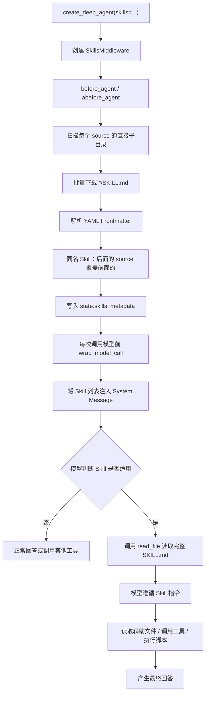

Skills 中间件（`SkillsMiddleware`）按 Agent Skills 规范扫描目录中的 `SKILL.md`，把各 Skill 的名称与描述注入系统消息，再由模型在需要时用 `read_file` 读取完整指令与附属文件。本篇说明文件结构、沙箱与其他后端的能力差异、中间件执行顺序，以及如何把共享 Skill 目录挂进第09章 Coding Agent 的沙箱并在 Studio 中验证。

文档：[Agent Skills 规范](https://agentskills.io/specification) · [Deep Agents Skills](https://docs.langchain.com/oss/python/deepagents/skills) · [`create_deep_agent`](https://reference.langchain.com/python/deepagents/graph/create_deep_agent)

## 文件结构

一个 Skill 是一个目录，目录内至少有 `SKILL.md`。规范要求 Frontmatter 中的 `name` 与目录名一致；`description` 须同时说明做什么、何时使用——模型只靠这一句决定是否加载正文。

```text
skills
└── skill-1/
    ├── SKILL.md          # 必须: metadata + instructions
    ├── scripts/          # 可选: 可执行的代码
    ├── references/       # 可选: 包含一些额外的文档，Agent可以在需要时阅读。
    ├── assets/           # 可选: 图片、schemas、...
    └── ...               # 任意其他文件
└── skill-2/
    ├── SKILL.md          # 必须: metadata + instructions
    ├── scripts/          # 可选: 可执行的代码
    ├── references/       # 可选: 包含一些额外的文档，Agent可以在需要时阅读。
    ├── assets/           # 可选: 图片、schemas、...
    └── ...               # 任意其他文件
```

## 后端选型

Skill 的发现与读取走当前 `backend`。能否执行 `scripts/` 中的脚本，取决于后端是否提供 Shell。

| 存储方案 | 功能 |
| --- | --- |
| 沙箱 | 拥有全部功能 |
| 其他 | 除执行之外的其他所有功能 |

沙箱后端提供 `execute`，模型可以按 `SKILL.md` 的指示运行捆绑脚本。`StateBackend`、`FilesystemBackend` 等只能发现与读取，不能执行脚本。

沙箱运行在隔离环境中，宿主磁盘上的 Skill 目录默认不可见。本篇把对象存储挂到 `/home/user/skills`，使沙箱内可以读取这些文件。

## 执行逻辑



`before_agent` 只处理第一层：扫描直接子目录、解析 Frontmatter、写入 `state.skills_metadata`。`wrap_model_call` 把这份清单注入系统消息。第二层由模型调用 `read_file` 完成；第三层（脚本、参考文档、资源）只在正文点名之后才会读取或执行。

## 沙箱挂载 Skill 目录

第08章的 `_get_metadata_config` 已挂载按 `thread_id` 隔离的 `workspace` 与 `output`。Skill 需要跨线程共享，因此增加一条挂到 `/home/user/skills`、桶内前缀为 `/skills` 的挂载点，不按 `key` 分目录。

`langchain_project/core/sandbox.py`：

```python
def _get_metadata_config(key: str):
  return {
    "metadata": {
      "fc.sandbox.storage.oss": json.dumps(
        {
          "mountPoints": [
            {
              "bucketName": sandbox_settings.oss_bucket,
              "mountDir": "/home/user/skills",
              "bucketPath": "/skills",
              "endpoint": sandbox_settings.oss_endpoint,
              "readOnly": False,
            },
            {
              "bucketName": sandbox_settings.oss_bucket,
              "mountDir": "/home/user/workspace",
              "bucketPath": f"/{key}/workspace",
              "endpoint": sandbox_settings.oss_endpoint,
              "readOnly": False,
            },
            {
              "bucketName": sandbox_settings.oss_bucket,
              "mountDir": "/home/user/output",
              "bucketPath": f"/{key}/output",
              "endpoint": sandbox_settings.oss_endpoint,
              "readOnly": False,
            },
          ]
        }
      ),
      "fc.sandbox.auth.role": sandbox_settings.role_arn,
    }
  }
```

| 沙箱路径（`mountDir`） | 对象存储位置 |
| --- | --- |
| `/home/user/skills` | `{oss_bucket}/skills`（共享，不按线程隔离） |
| `/home/user/workspace` | `{oss_bucket}/{key}/workspace` |
| `/home/user/output` | `{oss_bucket}/{key}/output` |

在对象存储中新建 `skills` 目录，按上一节的结构上传通用 Skill。沙箱内对该目录的读写，等价于对桶内 `/skills` 前缀的读写。


## 注入 skills

`langchain_project/agents/coding_agent.py`：其余模型、系统提示词与 `response_format` 与第09章相同。`skills` 指向沙箱内挂载路径，须以 `/` 结尾，表示扫描该目录的直接子目录，而不是把该路径本身当成一个 Skill。

```python
agent = create_deep_agent(
  model=model,
  tools=tools,
  backend=AliyunSandboxBackend(),
  system_prompt=system_prompt,
  response_format=ToolStrategy(
    CodingAgentResponse,
    tool_message_content="最终交付信息已生成。",
  ),
  skills=["/home/user/skills/"],
)
```

## Studio 验证

Studio 中向 Coding Agent 发送会命中已上传 Skill 的请求。系统消息中应出现 Skill 清单；模型判断适用后调用 `read_file` 读取对应 `SKILL.md`，再按其中的指令继续调用工具或执行脚本。


