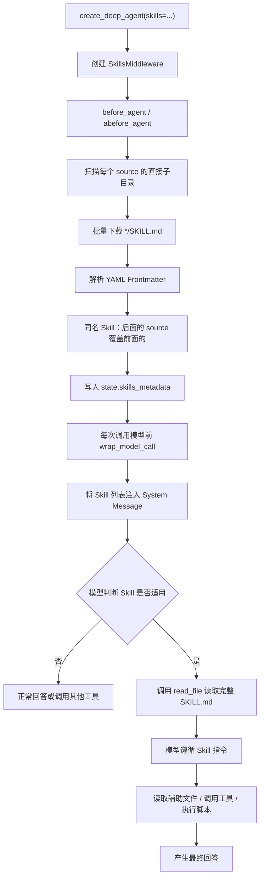

Skills 中间件（`SkillsMiddleware`）按 Agent Skills 规范扫描目录中的 `SKILL.md`，把各 Skill 的名称与描述注入系统消息，再由模型在需要时用 `read_file` 读取完整指令与附属文件。本篇说明文件结构、沙箱与其他后端的能力差异、中间件执行顺序，以及如何把共享 Skill 目录挂进服务端 Coding Agent（在隔离沙箱中编写、构建并部署前端产物的编码 Agent）的沙箱并在 Studio 中验证。

文档：[Agent Skills 规范](https://agentskills.io/specification) · [Deep Agents Skills](https://docs.langchain.com/oss/python/deepagents/skills) · [`create_deep_agent`](https://reference.langchain.com/python/deepagents/graph/create_deep_agent)

## 文件结构

一个 Skill 是一个目录，目录内至少有 `SKILL.md`。规范要求 Frontmatter 中的 `name` 与目录名一致；`description` 须同时说明做什么、何时使用——模型只靠这一句决定是否加载正文。

```text
skills
└── skill-1/
    ├── SKILL.md          # 必须: metadata + instructions
    ├── scripts/          # 可选: 可执行的代码
    ├── references/       # 可选: 包含一些额外的文档，Agent可以在需要时阅读。
    ├── assets/           # 可选: 图片、schemas、...
    └── ...               # 任意其他文件
└── skill-2/
    ├── SKILL.md          # 必须: metadata + instructions
    ├── scripts/          # 可选: 可执行的代码
    ├── references/       # 可选: 包含一些额外的文档，Agent可以在需要时阅读。
    ├── assets/           # 可选: 图片、schemas、...
    └── ...               # 任意其他文件
```

## 后端选型

Skill 的发现与读取走当前 `backend`。能否执行 `scripts/` 中的脚本，取决于后端是否提供 Shell。

| 存储方案 | 功能 |
| --- | --- |
| 沙箱 | 拥有全部功能 |
| 其他 | 除执行之外的其他所有功能 |

沙箱后端提供 `execute`，模型可以按 `SKILL.md` 的指示运行捆绑脚本。`StateBackend`、`FilesystemBackend` 等只能发现与读取，不能执行脚本。

沙箱运行在隔离环境中，宿主磁盘上的 Skill 目录默认不可见。本篇把对象存储挂到 `/home/user/skills`，使沙箱内可以读取这些文件。

## 执行逻辑



`before_agent` 只处理第一层：扫描直接子目录、解析 Frontmatter、写入 `state.skills_metadata`。`wrap_model_call` 把这份清单注入系统消息。第二层由模型调用 `read_file` 完成；第三层（脚本、参考文档、资源）只在正文点名之后才会读取或执行。

## 沙箱挂载 Skill 目录

沙箱工厂的 `_get_metadata_config` 生成对象存储挂载参数，原本已按 `key`（即 `thread_id`）隔离挂载 `workspace` 与 `output` 两个目录，桶内前缀分别为 `/{key}/workspace` 与 `/{key}/output`。Skill 需要跨线程共享，因此增加一条挂到 `/home/user/skills`、桶内前缀固定为 `/skills` 的挂载点，不按 `key` 分目录。下面给出加入 Skill 挂载点后的完整函数。

`langchain_project/core/sandbox.py`：

```python
def _get_metadata_config(key: str):
  return {
    "metadata": {
      "fc.sandbox.storage.oss": json.dumps(
        {
          "mountPoints": [
            {
              "bucketName": sandbox_settings.oss_bucket,
              "mountDir": "/home/user/skills",
              "bucketPath": "/skills",
              "endpoint": sandbox_settings.oss_endpoint,
              "readOnly": False,
            },
            {
              "bucketName": sandbox_settings.oss_bucket,
              "mountDir": "/home/user/workspace",
              "bucketPath": f"/{key}/workspace",
              "endpoint": sandbox_settings.oss_endpoint,
              "readOnly": False,
            },
            {
              "bucketName": sandbox_settings.oss_bucket,
              "mountDir": "/home/user/output",
              "bucketPath": f"/{key}/output",
              "endpoint": sandbox_settings.oss_endpoint,
              "readOnly": False,
            },
          ]
        }
      ),
      "fc.sandbox.auth.role": sandbox_settings.role_arn,
    }
  }
```

| 沙箱路径（`mountDir`） | 对象存储位置 |
| --- | --- |
| `/home/user/skills` | `{oss_bucket}/skills`（共享，不按线程隔离） |
| `/home/user/workspace` | `{oss_bucket}/{key}/workspace` |
| `/home/user/output` | `{oss_bucket}/{key}/output` |

在对象存储中新建 `skills` 目录，按上一节的结构上传通用 Skill。沙箱内对该目录的读写，等价于对桶内 `/skills` 前缀的读写。


## 注入 skills

`langchain_project/agents/coding_agent.py`：在服务端 Coding Agent 入口上增加 `skills` 参数。`skills` 指向沙箱内挂载路径，须以 `/` 结尾，表示扫描该目录的直接子目录，而不是把该路径本身当成一个 Skill。入口的其余部分照常配置：`model` 用 `init_chat_model` 初始化的 Anthropic 模型；`backend` 为对接阿里云沙箱、把文件与命令操作转到 `get_sandbox` 的 `AliyunSandboxBackend`；`response_format` 用 `ToolStrategy` 把结构化 schema `CodingAgentResponse` 挂成「提交结果」工具，模型结束时调用它写入最终响应。`tools` 为工程统一维护的工具列表（含把产物复制到输出目录并返回访问 URL 的 `deploy` 工具）。工程 `config`（含 `anthropic_settings`）与模拟模型 `mock_model` 的完整定义见第01章。

```python
from typing import Literal, Self

from deepagents import create_deep_agent
from langchain.agents.structured_output import ToolStrategy
from langchain.chat_models import init_chat_model
from pydantic import BaseModel, Field, model_validator

from langchain_project.core.config import anthropic_settings
from langchain_project.tools import tools
from langchain_project.backends import AliyunSandboxBackend

class DeployedArtifact(BaseModel):
  """已通过deploy工具部署的一个产物入口。"""

  name: str = Field(description="产物名称，例如首页或源码压缩包")
  mime_type: str = Field(
    description="产物的MIME类型，例如text/html、image/png或application/gzip"
  )
  url: str = Field(description="deploy工具返回的产物访问地址")

class CodingAgentResponse(BaseModel):
  """Coding Agent交付给用户的最终结构化响应。"""

  status: Literal["completed", "cannot_deliver"] = Field(
    description=(
      "已完成并部署产物时使用completed；"
      "需求超出平台交付能力时使用cannot_deliver"
    )
  )
  summary: str = Field(description="向用户说明完成内容或无法交付原因的简要总结")
  artifacts: list[DeployedArtifact] = Field(
    default_factory=list,
    description="deploy工具返回的全部产物入口；无法交付时为空列表",
  )

  @model_validator(mode="after")
  def validate_artifacts(self) -> Self:
    if self.status == "completed" and not self.artifacts:
      raise ValueError("completed响应必须包含至少一个已部署产物")
    if self.status == "cannot_deliver" and self.artifacts:
      raise ValueError("cannot_deliver响应不应包含已部署产物")
    return self

model = init_chat_model(
  model=anthropic_settings.default_model,
  model_provider="anthropic",
  thinking={"type": "disabled"},
)

system_prompt = """# 角色

你是一个专门用于编写代码的 Agent。

# 产物交付边界

- 平台只提供**静态资源部署**功能。
- 最终能够部署和交付给用户的代码产物必须由静态文件组成，例如 HTML、CSS、JavaScript、图片、配置文件，或者可构建为静态文件的 Vue 等前端工程。
- 沙箱具备编写、构建和临时运行后端服务的能力，但平台**没有提供后端服务的部署功能**。

## 无法交付的需求

如果用户要求交付依赖以下能力的应用：

- 服务器端 API
- 数据库
- 后端身份认证
- 后台定时任务
- 需要持续运行的服务进程

你必须直接说明相关后端部分无法部署和交付，并拒绝实现无法交付的后端部分。不要将这一限制描述为沙箱没有后端开发能力。

# 沙箱环境

整个文件系统都运行在沙箱中。

## 工程目录

- `/home/user/workspace` 是用于创建工程的根目录。
- 每个工程都应在该目录下创建独立的子目录。
- 子目录名称应根据工程内容合理命名。
- 例如，Vue 工程可以创建在 `/home/user/workspace/my-vue-app` 中，其中 `my-vue-app` 是工程名称。

## 可用工具

沙箱中已经提供：

- Node.js 环境
- Python 环境
- Git
- Tar

你可以使用这些工具搭建、构建、检查和整理工程。

## 产物打包

如果产物文件较多，可以使用 Tar 将整个工程打包成 `.tar.gz` 压缩包，并将压缩包作为最终产物提供给用户。

## 静态资源访问路径

- 使用工程构建静态产物时，必须特别注意静态资源的访问路径。最终产物会部署在多层子目录下，因此静态资源应优先使用相对路径作为前缀，不要使用以 `/` 开头的绝对路径，否则资源可能无法访问。
- 例如，应使用 `<script src="./assets/index.js"></script>` 或 ``，而不要使用 `<script src="/assets/index.js"></script>` 或 ``。
- 使用 Vite 等构建工具时，应进行对应配置。例如 Vite 应将 `base` 设置为 `"./"`，确保构建后的 JavaScript、CSS 和图片通过相对路径加载。

## 产物部署与交付

- 每次完成用户交付的工作后，都必须调用 `deploy` 工具部署最终产物。
- 调用时，`path` 应指向已经检查或构建完成的文件或目录，`target_dirname` 应使用工程名称，`entry_files` 应列出需要交付给用户的入口文件。
- 只有 `deploy` 调用成功并返回访问地址后，才算完成交付。最终回复中必须把这些访问地址提供给用户。
"""

agent = create_deep_agent(
  model=model,
  tools=tools,
  backend=AliyunSandboxBackend(),
  system_prompt=system_prompt,
  response_format=ToolStrategy(
    CodingAgentResponse,
    tool_message_content="最终交付信息已生成。",
  ),
  skills=["/home/user/skills/"],
)
```

## Studio 验证

Studio 中向 Coding Agent 发送会命中已上传 Skill 的请求。系统消息中应出现 Skill 清单；模型判断适用后调用 `read_file` 读取对应 `SKILL.md`，再按其中的指令继续调用工具或执行脚本。


