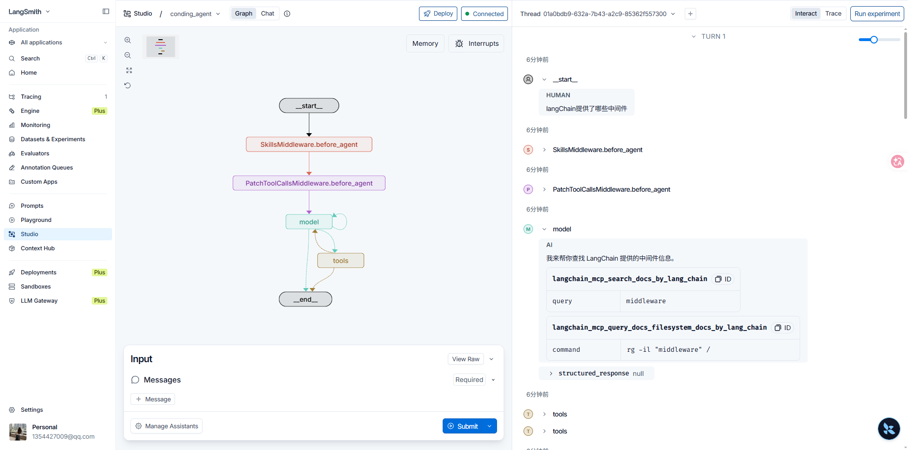
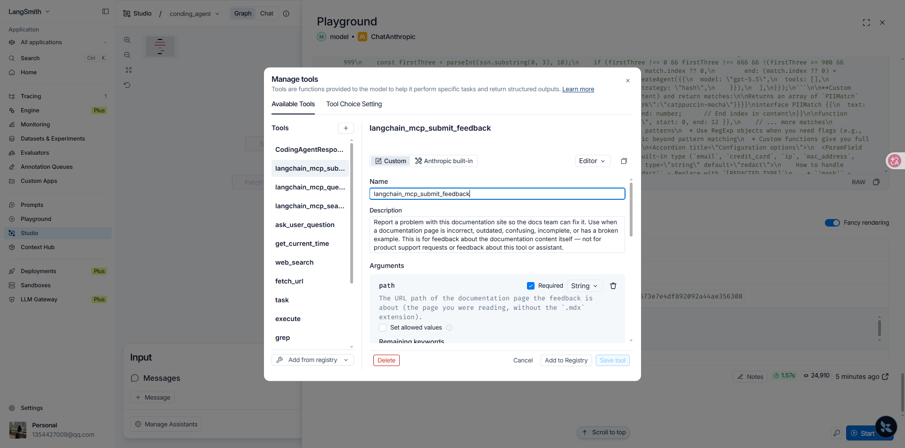

MCP 工具注入是在创建 Agent 时连接 MCP 服务器、一次性拉取远程工具，再与本地工具合并后传给 `create_deep_agent`。连接发生在图加载阶段，而不是对话过程中按需绑定。本篇说明 `MultiServerMCPClient` 的 `connections` 与 `tool_name_prefix`，以及如何在第09章的 Coding Agent 上接入 LangChain 文档 MCP。

Agent底层逻辑第14章的 MCP 规定 Host 如何向外部 Server 发现并调用工具：schema 的权威在 Server，客户端只负责列出与调用。本篇用 `langchain-mcp-adapters` 把 `tools/list` 的结果转成 LangChain `StructuredTool`。Skill 是提示词模块，见第14章；二者差异见 Agent底层逻辑第15章，本篇不重复。第11章已说明：路径权限不约束 MCP 工具。图入口改为异步工厂，Agent Server 加载该工厂时连接 MCP 并拉取远程工具。

文档：[MCP](https://docs.langchain.com/oss/python/langchain/mcp) · [`MultiServerMCPClient`](https://reference.langchain.com/python/langchain-mcp-adapters/client/MultiServerMCPClient) · [`create_deep_agent`](https://reference.langchain.com/python/deepagents/graph/create_deep_agent)

| 概念 | 作用 |
| --- | --- |
| MCP | Model Context Protocol。向外部程序发现并调用工具的开放协议 |
| `MultiServerMCPClient` | 同时连接多台 MCP 服务器，并把远程工具转成 LangChain 工具 |
| `connections` | 服务器名到传输配置的映射。本篇使用 `streamable_http` |
| `tool_name_prefix` | 为 True 时，工具名加上服务器名前缀，避免多台服务器重名 |
| `get_tools()` | 在创建 Agent 时一次性拉取全部远程工具，不是对话中再绑定 |

## 安装

```bash
uv add langchain-mcp-adapters
```

## 连接 MCP 服务器

`MultiServerMCPClient` 按 `connections` 中的条目建立连接。`create_agent()` 被 Agent Server 加载时就会连接这些 MCP，调用一次 `get_tools()` 拉取全部远程工具，再和本地 `tools` 一起传给 `create_deep_agent`。绑定发生在图加载阶段，而不是对话过程中。

```python
import asyncio
from langchain_mcp_adapters.client import MultiServerMCPClient

client = MultiServerMCPClient(
  connections={
    "langchain_mcp": {
      "transport": "streamable_http",
      "url": "https://docs.langchain.com/mcp",
    }
  },
  tool_name_prefix=True
)
```

要接入更多 MCP，在 `connections` 里继续加条目。`tool_name_prefix=True` 时，新服务器的工具名会变成 `another_mcp_xxx`，避免与已有工具重名。

```python
connections={
  "langchain_mcp": {
    "transport": "streamable_http",
    "url": "https://docs.langchain.com/mcp",
  },
  "another_mcp": {
    "transport": "streamable_http",
    "url": "https://example.com/mcp",
  },
}
```

> **说明：** 这里加的是 MCP 服务器，不是项目里用 `@tool` 声明的本地工具。本地工具仍走 `langchain_project.tools`，再通过 `tools=[*tools, *mcp_tools]` 合并。改完 `connections` 后须让 Studio 重新加载 graph（热重载或重启），新 MCP 才会出现在 Manage tools 里。

## 拉取工具

使用 `get_tools()` 一次性列出当前已连接服务器上的全部工具：

```python
tools = asyncio.run(client.get_tools())
tools
```

返回如下：

```text
[
  StructuredTool(
    name='langchain_mcp_search_docs_by_lang_chain',
    description='Search across the Docs by LangChain knowledge base to find relevant information, code examples, API references, and guides. Use this tool when you need to answer questions about Docs by LangChain. If you need the full content of a specific page, use query_docs_filesystem.',
    args_schema={
      'type': 'object',
      'properties': {'query': {'type': 'string', 'description': 'Search query'}},
      'required': ['query']
    }
  ),
  StructuredTool(
    name='langchain_mcp_query_docs_filesystem_docs_by_lang_chain',
    description='Run a read-only shell-like query against a virtualized, in-memory filesystem of Docs by LangChain pages. Read a page with head/cat on its .mdx path; search with rg; explore structure with tree/ls. Each call is stateless. Output is truncated to 30KB per call.',
    args_schema={
      'type': 'object',
      'properties': {
        'command': {
          'type': 'string',
          'description': 'A shell command to run against the virtualized documentation filesystem'
        }
      },
      'required': ['command']
    }
  ),
  StructuredTool(
    name='langchain_mcp_submit_feedback',
    description='Report a problem with this documentation site so the docs team can fix it. For documentation content itself — not product support.',
    args_schema={
      'type': 'object',
      'properties': {
        'path': {'type': 'string', 'description': 'The URL path of the documentation page (without .mdx)'},
        'feedback': {'type': 'string', 'description': 'A clear description of the documentation issue or suggestion'}
      },
      'required': ['path', 'feedback']
    }
  )
]
```

三件工具的名称都以 `langchain_mcp_` 开头，来自 `tool_name_prefix=True` 与服务器名 `langchain_mcp`。`search_docs_by_lang_chain` 按查询检索文档并返回标题与链接；需要整页时改用 `query_docs_filesystem`，对虚拟文档文件系统执行 `head` / `cat` / `rg` 等只读命令；`submit_feedback` 提交文档站点问题，不是产品支持。

## 注入 Coding Agent

`langchain_project/agents/coding_agent.py`：把模块级 `agent` 改成异步工厂 `create_agent`。其余模型、系统提示词、`response_format` 与 `skills` 与第09章、第14章相同。

```python
from langchain_mcp_adapters.client import MultiServerMCPClient
from langchain_project.tools import tools
from langchain_project.backends import AliyunSandboxBackend

async def create_agent():
  client = MultiServerMCPClient(
    connections={
      "langchain_mcp": {
        "transport": "streamable_http",
        "url": "https://docs.langchain.com/mcp",
      }
    },
    tool_name_prefix=True,
  )
  mcp_tools = await client.get_tools()

  agent = create_deep_agent(
    model=model,
    tools=[*tools, *mcp_tools],
    backend=AliyunSandboxBackend(),
    system_prompt=system_prompt,
    response_format=ToolStrategy(
      CodingAgentResponse,
      tool_message_content="最终交付信息已生成。",
    ),
    skills=["/home/user/skills/"],
  )

  return agent
```

`tools` 是本地自定义工具（含第09章的 `deploy`）；`mcp_tools` 是本次 `get_tools()` 的结果。合并后模型在同一轮 ReAct 里既能调本地工具，也能调 MCP 工具。

## 部署清单

`langgraph.json`：图入口从模块级对象改为异步工厂。Agent Server 加载该工厂时连接 MCP 并拉取远程工具。

```json
{
  "python_version": "3.13",
  "source": {
    "kind": "uv",
    "root": "."
  },
  "graphs": {
    "coding_agent": "langchain_project.agents.coding_agent:create_agent",
    "multimodal_demo": "langchain_project.agents.demo.multimodal_demo:agent"
  },
  "env": ".env"
}
```

## Studio 验证

重新加载 graph 后，Manage tools 中应出现带 `langchain_mcp_` 前缀的三件工具。向 Coding Agent 询问 LangChain 文档相关问题，模型会调用 `langchain_mcp_search_docs_by_lang_chain` 或 `langchain_mcp_query_docs_filesystem_docs_by_lang_chain`。




