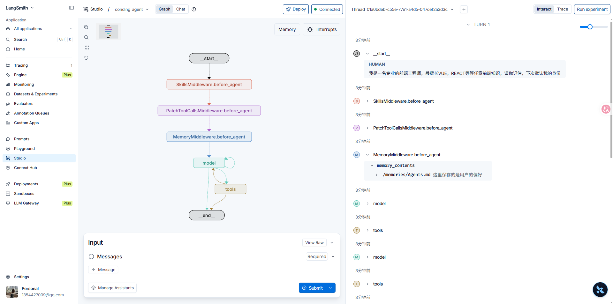
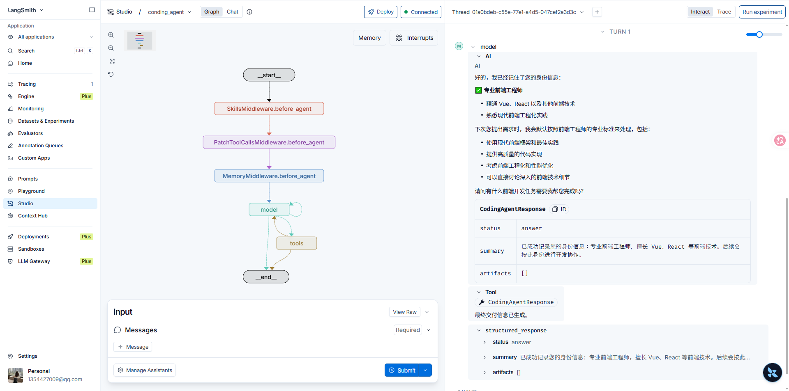

Memory 中间件（`MemoryMiddleware`）在每次运行开始时把指定的记忆文件写入系统提示词，供模型读取用户偏好与项目约定；模型也可通过文件系统工具回写这些文件。与第14章的 Skill 不同，记忆全文始终注入，没有渐进披露。本篇把记忆路径路由到本机目录，使偏好在沙箱销毁后仍然保留，并在 Studio 中验证写入结果。

Agent底层逻辑第07章把「外部记忆」与 Session 并列：用户偏好、长期事实写入外部存储，需要时注入当前上下文。LangGraph第26章的 Store、第27章的长期记忆是键值存储那条落地路径。本篇用文件实现：第06章的 `memory` 传入路径列表，由 `MemoryMiddleware` 注入；落点用第12章的 `CompositeBackend`，把 `/memories/` 指到第07章的 `FilesystemBackend`。默认后端仍是第09章的沙箱，记忆不进沙箱、不进检查点。

文档：[Context engineering](https://docs.langchain.com/oss/python/deepagents/context-engineering) · [Customization](https://docs.langchain.com/oss/python/deepagents/customization) · [`CompositeBackend`](https://reference.langchain.com/python/deepagents/backends/composite/CompositeBackend) · [`create_deep_agent`](https://reference.langchain.com/python/deepagents/graph/create_deep_agent)

## 记忆文件

先在本机准备一份初始记忆。`backup/Agents.md`：

```md
这里保存的是用户的偏好
```

`memory` 里写的是虚拟文件系统路径 `/memories/Agents.md`，不是宿主路径。该路径由下一节的路由转到 `backup/Agents.md`。

## 路由到本机目录

第09章的默认后端是 `AliyunSandboxBackend`。沙箱在 `deploy` 后销毁，按 `thread_id` 隔离的工作区也不适合保存跨会话偏好。第12章的 `CompositeBackend` 可以把 `/memories/` 指到本机目录：匹配前缀后剥掉 `/memories/`，`/memories/Agents.md` 落到 `root_dir/Agents.md`。其余路径仍走沙箱。

`langchain_project/agents/coding_agent.py`：其余模型、系统提示词、`response_format` 与 `skills` 与第09章、第14章相同。若已按第15章改为异步工厂，把同一组 `backend` 与 `memory` 写进 `create_agent` 即可。

```python
from deepagents.backends import CompositeBackend, FilesystemBackend
from langchain_project.backends import AliyunSandboxBackend

agent = create_deep_agent(
  model=model,
  tools=tools,
  backend=CompositeBackend(
    default=AliyunSandboxBackend(),
    routes={
      "/memories/": FilesystemBackend(
        root_dir="F:/python/langChain-project/backup"
      )
    },
  ),
  system_prompt=system_prompt,
  response_format=ToolStrategy(
    CodingAgentResponse,
    tool_message_content="最终交付信息已生成。",
  ),
  skills=["/home/user/skills/"],
  memory=["/memories/Agents.md"],
)
```

`FilesystemMiddleware` 按路径把 `read_file` / `write_file` 分发给对应后端。模型更新偏好时调用文件工具写入 `/memories/Agents.md`，实际文件落在本机 `backup/Agents.md`。官方文档的长期记忆示例常把 `/memories/` 指到 `StoreBackend`；本篇用磁盘文件，不经过 LangGraph第26章的 Store。

## Studio 验证

Studio 中进行会暴露用户身份或技术偏好的对话。系统提示词在运行开始时已包含 `Agents.md` 的当前内容；模型若判断需要记住，会调用 `write_file` 写回 `/memories/Agents.md`。





本机 `backup/Agents.md` 变为：

```text
# 用户偏好

## 用户身份
- 专业前端工程师
- 擅长技术栈：Vue、React 以及其他前端技术

## 开发偏好
- 默认使用前端技术栈进行开发
- 代码质量和最佳实践很重要
- 熟悉现代前端工程化工具和流程
```

新开一条 Thread 后，`MemoryMiddleware` 会再次读取这份文件并注入系统提示词。沙箱工作区随线程隔离并在销毁后消失，这份偏好仍在。
