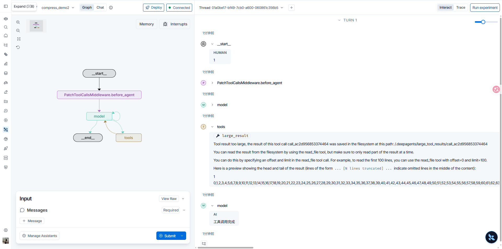
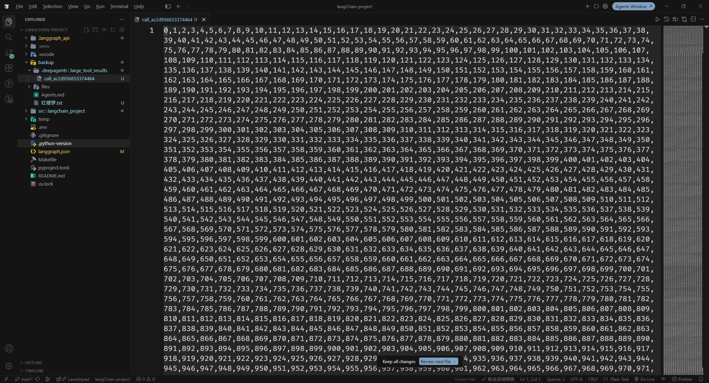

上下文压缩是在保证任务所需语义连贯的前提下，精简进入模型上下文窗口的内容。长任务会产生超长工具结果与对话历史；若全部进入当次请求，会超出窗口限制。本篇说明两处介入点：对新产生的消息立即处理（新消息防爆），以及对旧消息做摘要（上下文摘要）；并给出 `FilesystemMiddleware` 与 `SummarizationMiddleware` 的阈值配置，以及用 Agent Server SDK 触发卸载与摘要。

第06章默认 harness 已组装摘要与大结果卸载，无须额外挂载这两类中间件即可生效。立即卸载由第05章清单中的 `FilesystemMiddleware` 完成，完整内容写入第07章的 `backend`；旧消息摘要由同清单中的 `SummarizationMiddleware` 完成。内部产物路径可用第12章 `CompositeBackend` 的 `artifacts_root` 指定。

文档：[Context engineering](https://docs.langchain.com/oss/python/deepagents/context-engineering) · [`FilesystemMiddleware`](https://reference.langchain.com/python/deepagents/middleware/filesystem/FilesystemMiddleware) · [`SummarizationMiddleware`](https://reference.langchain.com/python/deepagents/middleware/summarization)

## 新消息防爆

新消息防爆针对刚产生、模型当前正在使用的消息，处理立即发生。新消息构成当前工作内容的因果链，处理时不得打断消息之间的因果关系。

### 工具返回防爆

主要手段是窗口控量，并以卸载作为超出阈值时的兜底。

#### 窗口控量

对容易产生大结果的工具，通过参数限制模型单次读取的完整结果量。第07章的 `read_file` 提供 `offset` 与 `limit`，并给出默认值，使模型按行分页读取，而不是一次取回整份文件。

`langchain_project/agents/demo/compress_demo1.py`：第05章的 Mock Model 固定调用 `read_file`，`offset=0`、`limit=10`。`FilesystemBackend` 指向本机 `backup`，其中有 `红楼梦.txt`。工具返回后模型输出「工具调用完成」。将该图登记为 `compress_demo1`，供 Studio 加载。

```python
from deepagents import create_deep_agent
from langchain_project.core.mock_model import mock_model
from deepagents.backends import FilesystemBackend

model = mock_model(
  {
    "responses": [
      {
        "tool_calls": [
          {
            "name": "read_file",
            "args": {
              "file_path": "./红楼梦.txt",
              "offset": 0,
              "limit": 10,
            },
          }
        ]
      }
    ],
    "rules": [
      {
        "when": {"last_message": "tool_result"},
        "respond": {"reasoning": "", "text": "工具调用完成"},
      }
    ],
  }
)

agent = create_deep_agent(
  model=model,
  backend=FilesystemBackend(
    root_dir="F:/python/langChain-project/backup"
  ),
)
```

Studio 中任发一条消息。模型调用 `read_file`，`limit=10`；工具返回 `lines 1-10 of 28409`，并提示 `next offset 10`。整份文件共 28409 行，本轮只读入前 10 行。


#### 卸载兜底

工具返回超过阈值时立即卸载：完整结果写入 `backend`，交给模型的是截断后的预览与完整结果引用。

```text
[卸载后的结果] + [完整结果引用] → 模型
```

该能力由 `FilesystemMiddleware` 实现。工具结果卸载阈值由 `tool_token_limit_before_evict` 控制，默认 `20000` token。调整阈值时，构造同名实例并传入 `create_deep_agent` 的 `middleware`，按第06章规则替换默认项，并同时传入当前 `backend`。

```python
from deepagents.middleware.filesystem import FilesystemMiddleware

FilesystemMiddleware(
  backend=backend,
  tool_token_limit_before_evict=20000,
)
```

卸载结果、会话历史等内部文件写入默认后端。第12章已说明这些产物不宜落到磁盘；若需指定内部路径的根目录，在 `CompositeBackend` 上设置 `artifacts_root`：

```python
backend=CompositeBackend(
  default=...,
  routes={},
  artifacts_root="/home/user/workspace/.deepagents",
)
```

`langchain_project/agents/demo/compress_demo2.py`：第05章的 Mock Model 固定调用自定义工具 `large_result`，返回 10 万个数字拼接的超长字符串。`CompositeBackend` 的 default 指向本机 `backup`，`artifacts_root` 为 `/.deepagents`。将该图登记为 `compress_demo2`，供 Studio 加载。

```python
from deepagents import create_deep_agent
from langchain_project.core.mock_model import mock_model
from deepagents.backends import FilesystemBackend, CompositeBackend
from langchain.tools import tool

model = mock_model(
  {
    "responses": [
      {
        "tool_calls": [
          {
            "name": "large_result",
            "args": {},
          }
        ]
      }
    ],
    "rules": [
      {
        "when": {"last_message": "tool_result"},
        "respond": {"reasoning": "", "text": "工具调用完成"},
      }
    ],
  }
)

@tool
def large_result():
  "工具会返回超大的结果"
  return ",".join([str(i) for i in range(100000)])

agent = create_deep_agent(
  model=model,
  backend=CompositeBackend(
    default=FilesystemBackend(
      root_dir="F:/python/langChain-project/backup"
    ),
    routes={},
    artifacts_root="/.deepagents",
  ),
  tools=[large_result],
)
```

Studio 中任发一条消息。模型调用 `large_result`；工具返回提示结果过大，完整内容写入 `/deepagents/large_tool_results/call_ac2d956853374464`，正文只保留首尾预览。



本机对应文件即为该卸载路径下的完整结果（0 至 99999 的逗号分隔数字）。



### 用户消息防爆

用户消息超过阈值时立即卸载，同样由 `FilesystemMiddleware` 实现。阈值由 `human_message_token_limit_before_evict` 控制，默认 `50000` token。

```python
FilesystemMiddleware(
  backend=backend,
  human_message_token_limit_before_evict=50000,
)
```

`langchain_project/agents/demo/compress_demo3.py`：Mock Model 只返回固定文本，用于观察用户消息卸载，不调用工具。`FilesystemBackend` 指向本机 `backup`。将该图登记为 `compress_demo3`。

```python
from deepagents import create_deep_agent
from deepagents.backends import FilesystemBackend
from langchain_project.core.mock_model import mock_model

model = mock_model(
  {
    "responses": [
      {
        "reasoning": "我应该按照模拟的配置返回给用户消息",
        "text": "你好，我是由配置文件驱动的模拟模型。你可以修改 mock_model.config.jsonc 来改变我的行为。",
      }
    ],
    "rules": [],
  }
)

agent = create_deep_agent(
  model=model,
  backend=FilesystemBackend(
    root_dir="F:/python/langChain-project/backup"
  ),
)
```

用 SDK 向该图发送约 10 万行用户消息。`assistant_id` 须与已部署的 `compress_demo3` 一致。

```python
from langgraph_sdk import get_client

client = get_client(url="http://127.0.0.1:2024")

assistant_id = "bc46c028-583a-563c-8327-8ab22872af90"
thread = await client.threads.create(metadata={"__name__": "用户消息卸载"})
thread_id = thread["thread_id"]
```

```python
resp = await client.runs.wait(
  input={
    "messages": [
      {
        "role": "user",
        "content": "\n".join([f"第{i}条消息" for i in range(1, 100000)]),
      }
    ]
  },
  thread_id=thread_id,
  assistant_id=assistant_id,
)
```

Playground 中该条 Human 已卸载：提示完整内容写入 `/conversation_history/8aa5398c-4a78-4325-9fd1-5c37f6248074.md`，正文只保留首尾预览，中间约 99989 行被截断。本机对应文件为 `backup/conversation_history/8aa5398c-4a78-4325-9fd1-5c37f6248074.md`。


新消息防爆只覆盖工具返回与用户消息。下列三项不立即处理：

1. **系统提示词**：不立即卸载。它是指令而非工作产物，截断会破坏 Agent 行为。体积靠第14章 Skill 的渐进披露与第16章记忆精简控制。
2. **工具参数**：不立即卸载。当前轮次的 `write_file` / `edit_file` 参数属于正在进行的因果链；完整内容已落入文件后，等对话变旧、达到窗口阈值再截断，见下一节。
3. **模型回复的普通消息**：不立即卸载。当前回复是正在工作的内容，立即摘要会打断因果；旧消息由上下文摘要处理。

## 上下文摘要

上下文摘要只处理旧消息。摘要会使旧的因果关系变得模糊；因其属于历史因果，对当前会话的影响较小。

`create_deep_agent` 默认已挂上 `SummarizationMiddleware`。上下文达到模型窗口的指定比例、且没有更多可卸载内容时，由模型生成结构化摘要，替换工作记忆中的旧消息；被替换的原文写入后端，需要细节时可用 `read_file` 再读。

### 处理旧的特殊工具参数

Agent 运行期间有两类特殊工具调用：

- `write_file`：传入的新内容可能过大
- `edit_file`：传入的旧内容与新内容都可能过大

二者的共同特点是：

- 工具执行后，有价值的结果已落入文件
- 模型通常关心文件的当前状态，工具调用历史只代表改动过程
- 工具调用与工具返回之间的因果关系对当前推理已减弱

因此在对话接近窗口上限时，可卸载旧的 `write_file` / `edit_file` 参数，只保留截断提示。`trigger` / `keep` 可写成窗口比例（例如 `("fraction", 0.85)` / `("fraction", 0.10)`），也可写成绝对 token 数与消息条数。

`langchain_project/agents/demo/compress_demo4.py`：Mock Model 反复调用 `write_file`，每次写入约 1 万行；`truncate_args_settings` 在 60000 token 时开始检查，最近 5 条消息的参数保持完整，单个参数超过 2000 字符才卸载。将该图登记为 `compress_demo4`。

```python
from deepagents import create_deep_agent
from deepagents.backends import FilesystemBackend
from deepagents.middleware import SummarizationMiddleware
from langchain_project.core.mock_model import mock_model

content = "\n".join([f"第{i}条数据" for i in range(1, 10001)])

model = mock_model(
  {
    "responses": [
      {
        "tool_calls": [
          {
            "name": "write_file",
            "args": {
              "file_path": "large_result.txt",
              "content": content,
            },
          }
        ]
      }
    ],
    "rules": [
      {
        "when": {"last_message": "tool_result"},
        "max_tool_calls": 20,
        "respond": {
          "reasoning": "需要再次调用工具获取更多数据。",
          "tool_calls": [
            {
              "name": "write_file",
              "args": {
                "file_path": "large_result.txt",
                "content": content,
              },
            }
          ],
        },
        "final": {"text": "调用工具完成"},
      }
    ],
  }
)

backend = FilesystemBackend(
  root_dir="F:/python/langChain-project/backup"
)

summarization_middleware = SummarizationMiddleware(
  model=model,
  backend=backend,
  truncate_args_settings={
    "trigger": ("tokens", 60_000),
    "keep": ("messages", 5),
    "max_length": 2_000,
  },
)

agent = create_deep_agent(
  model=model,
  backend=backend,
  middleware=[summarization_middleware],
)
```

Studio 中任发一条消息。较早的 `write_file` 参数被截成 `第1条数据\n第2条数据\n第3条数据\n第4...(argument truncated)`；完整内容已在 `large_result.txt`。


### 处理整个上下文中的旧消息

整段对话达到窗口的指定比例时触发摘要，并保留最近若干消息不参与摘要。本例将模型 `profile.max_input_tokens` 设为 `80000`，`trigger` 为窗口的 85%，`keep` 为最近 4 条，`trim_tokens_to_summarize=4000`。

`langchain_project/agents/demo/compress_demo5.py`：使用真实模型。将该图登记为 `compress_demo5`。

```python
from deepagents import create_deep_agent
from deepagents.backends import FilesystemBackend
from deepagents.middleware import SummarizationMiddleware
from langchain.chat_models import init_chat_model
from langchain_project.core.config import openai_settings

model = init_chat_model(
  model=openai_settings.default_model,
  model_provider="openai",
  extra_body={
    "enable_thinking": False,
  },
  profile={
    "max_input_tokens": 80_000,
  },
)
backend = FilesystemBackend(
  root_dir="F:/python/langChain-project/backup"
)

summarization_middleware = SummarizationMiddleware(
  model=model,
  backend=backend,
  trigger=("fraction", 0.85),
  keep=("messages", 4),
  trim_tokens_to_summarize=4000,
)

agent = create_deep_agent(
  model=model,
  backend=backend,
  middleware=[summarization_middleware],
)
```

用 SDK 构造约 8.6 万 token 的历史对话（超过 85% 阈值），再交给该图。`assistant_id` 须与已部署的 `compress_demo5` 一致。

```python
from langgraph_sdk import get_client

client = get_client(url="http://127.0.0.1:2024")

assistant_id = "58534c12-9bc2-5cd2-b195-be42dfcd1f1f"
thread = await client.threads.create(metadata={"__name__": "历史上下文摘要"})
thread_id = thread["thread_id"]
```

```python
messages = []

for round_id in range(1, 11):
  user_context = "\n".join(
    f"第{round_id}轮需求记录{i}：报表需保留订单编号、客户名称、销售额和退款状态。"
    for i in range(1, 426)
  )
  assistant_context = "\n".join(
    f"第{round_id}轮处理记录{i}：已核对字段映射、异常值规则和汇总口径。"
    for i in range(1, 426)
  )
  messages.extend([
    {"role": "user", "content": user_context},
    {"role": "assistant", "content": assistant_context},
  ])
```

```python
resp = await client.runs.wait(
  input={
    "messages": messages
  },
  thread_id=thread_id,
  assistant_id=assistant_id,
)
```

Studio 中同一次 `model` 节点可见两次 LLM 调用：先摘要，再基于摘要作答。


Playground 中旧消息被结构化摘要替换，并注明原文已写入 `/conversation_history/session_4c32a7ac4d324108869d35f2dbbb0bfc.md`。摘要含 SESSION INTENT、SUMMARY、ARTIFACTS、NEXT STEPS；最近消息仍完整保留。


