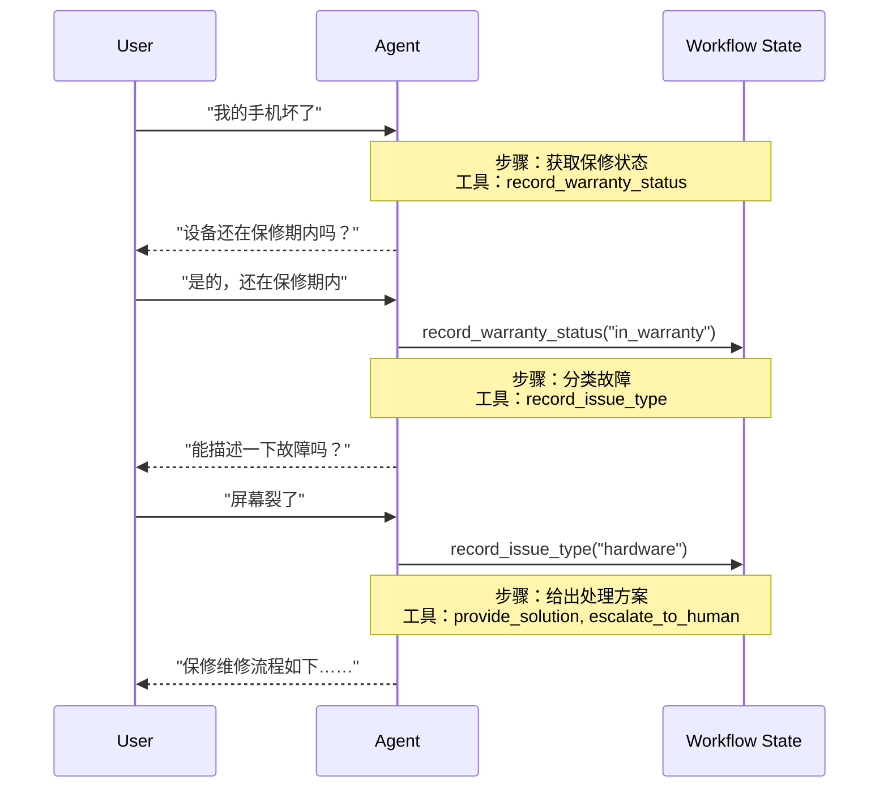

Handoff 模式中，行为随状态变化。工具更新一个跨回合保持的状态变量（例如 `current_step` 或 `active_agent`），系统读取该变量来调整行为：换成另一套配置（系统提示词与工具），或把任务交给另一个智能体。因此它既用于不同智能体之间的移交，也用于同一个智能体内部的动态配置。控制权随这次状态更新移交，由切换后的智能体或更新后的配置继续处理用户消息。

Handoff 一词由 OpenAI 提出，指通过工具调用（例如 `transfer_to_sales_agent`）在智能体或状态之间移交控制权。

文档：[Handoffs](https://docs.langchain.com/oss/python/langchain/multi-agent/handoffs)

下面以保修客服说明这种移交如何跨回合发生。用户消息进入当前步骤，该步骤只暴露自己的工具。工具把结果写入工作流状态后，下一步的提示词与工具才启用，并由同一智能体继续直接答复用户。



手机报修后，当前步骤是获取保修状态，可用工具只有 `record_warranty_status`。智能体先问设备是否在保修期内。用户确认仍在保修期内，工具写入 `in_warranty`，步骤变为故障分类，可用工具换成 `record_issue_type`。智能体再请用户描述故障。用户说明屏幕破裂后，工具写入 `hardware`，步骤进入处理方案，此时才提供 `provide_solution` 与 `escalate_to_human`，并由智能体直接说明保修维修流程。

## 关键特性

- **状态驱动**：行为由持久状态变量决定。单智能体常用 `current_step`，多智能体子图常用 `active_agent`。同一套对话在不同取值下使用不同的系统提示词与工具，或进入不同的智能体节点。
- **工具完成转移**：转移由工具发起。工具返回 `Command`，在 `update` 中写入新的状态值。模型调用该工具之后，下一轮按新状态继续。
- **直接与用户交互**：每个状态的配置自己处理用户消息。当前步骤可以直接向用户提问、确认并给出答复。
- **状态跨回合保持**：`current_step`、保修状态等字段写入图状态。创建智能体时传入检查点（例如 `InMemorySaver`），这些字段在多轮对话中保留。前一步完成之后，下一步的工具才出现在模型可见的工具列表中。

## 适用场景

需要按固定顺序解锁能力时使用本模式：前一步未完成，后一步的工具与提示词不启用。智能体要在不同阶段直接与用户对话。客服、退款、分阶段收集信息属于这一类，例如必须先拿到保修标识，再处理退款。上文的保修流程即按此推进：保修状态未写入之前，故障分类与处理方案的工具都不出现。

## 转移约定

移交工具的返回值是 `Command`。模型发起工具调用后，会话中须有一条 `tool_call_id` 与该调用对应的 `ToolMessage`，这次工具往返才闭合。`update` 改写 `messages` 时，把这条 `ToolMessage` 一并写入。

```python
from langchain.messages import ToolMessage
from langchain.tools import tool
from langgraph.types import Command

@tool
def transfer_to_specialist(runtime) -> Command:
  """移交给专职智能体。"""
  return Command(
    update={
      "messages": [
        ToolMessage(
          content="Transferred to specialist",
          tool_call_id=runtime.tool_call_id,
        )
      ],
      "current_step": "specialist",
    }
  )
```

## 两种实现

多数移交用一个智能体加中间件完成：中间件在每次模型调用前读取状态，替换系统提示词和当前可用工具。节点本身已经是带反思或检索步骤的复杂图时，再把多个智能体做成子图节点，用移交工具在节点之间跳转。

### 单智能体与中间件

状态类型扩展 `AgentState`，增加 `current_step` 以及本流程要记住的字段。记录类工具在 `Command.update` 里同时写入业务字段和下一步名称。`wrap_model_call` 读取 `current_step`，用 `request.override` 换上该步骤的提示词和工具。创建智能体时传入 `state_schema`、该中间件和检查点。注册到智能体上的可以是各步骤工具的并集；真正暴露给模型的集合由中间件按当前步骤裁剪。提示词中的占位符用当前状态填充，例如把已记录的 `warranty_status` 写进专家步骤的说明。

```python
from langchain.agents.middleware import wrap_model_call

configs = {
  "triage": {
    "prompt": "收集保修信息。已知保修状态：{warranty_status}",
    "tools": [record_warranty_status],
  },
  "specialist": {
    "prompt": "根据保修状态 {warranty_status} 给出处理方案。",
    "tools": [provide_solution, escalate],
  },
}

@wrap_model_call
def apply_step_config(request, handler):
  step = request.state.get("current_step", "triage")
  config = configs[step]
  request = request.override(
    system_prompt=config["prompt"].format(**request.state),
    tools=config["tools"],
  )
  return handler(request)
```

### 多智能体子图

销售、支持等智能体各自是图上的一个节点。移交工具返回 `Command(goto=目标节点, graph=Command.PARENT)`，父图改去执行另一个节点。父图状态用 `active_agent` 记住当前节点，下一轮用户消息仍进入该智能体。

子图之间传递哪些消息要显式写出。父图的 `messages` 更新放入两条：触发本次移交的 `AIMessage`，以及 `tool_call_id` 与之匹配的 `ToolMessage`。接收方由此看到一次完整的工具往返。子图内部的推理与工具轨迹留在子图；接收方需要这些结论时，把摘要写进 `ToolMessage` 的内容。上述写法假定本次只调用了移交工具。一轮结束、控制权回到用户时，最后一条消息是不含工具调用的 `AIMessage`。

```python
from langchain.messages import AIMessage, ToolMessage
from langchain.tools import tool, ToolRuntime
from langgraph.types import Command

@tool
def transfer_to_sales(runtime: ToolRuntime) -> Command:
  """移交给销售智能体。"""
  last_ai_message = next(
    msg
    for msg in reversed(runtime.state["messages"])
    if isinstance(msg, AIMessage)
  )
  transfer_message = ToolMessage(
    content="Transferred to sales agent",
    tool_call_id=runtime.tool_call_id,
  )
  return Command(
    goto="sales_agent",
    update={
      "active_agent": "sales_agent",
      "messages": [last_ai_message, transfer_message],
    },
    graph=Command.PARENT,
  )
```

父图在每个智能体节点之后检查最后一条消息。它是不含工具调用的 `AIMessage` 时，本轮结束；否则按 `active_agent` 进入对应节点。入口同样按 `active_agent` 路由，状态里还没有该字段时进入默认智能体。

## 设计时要决定的事

- **上下文如何过滤**：每个智能体收到完整历史、截取后的片段，或一份摘要。角色不同，需要的上下文也不同。
- **移交工具是否带副作用**：移交可以只更新路由状态，也可以在同一次调用里创建工单。副作用与移交写在同一工具中时，把这项职责写进工具说明。
- **token 如何控制**：对话变长后，选择性传递和摘要比原样转发子图历史更省上下文。本模式按状态串行推进，历史随移交累积。
