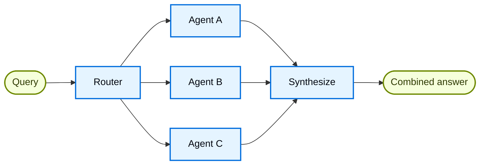

路由模式先用一个路由步骤对输入分类，再把请求导向一个或多个专职处理单元，最后把各单元的结果整合为一次响应。分类在专职处理之前完成；处理单元只处理已经分给自己的输入。路由步骤通常是一次分类调用或一组规则，分类结束后把请求交出。下图为分发结构：查询进入路由步骤，再并行交给多个专职智能体，各路结果经综合后成为一次响应。

文档：[Router](https://docs.langchain.com/oss/python/langchain/multi-agent/router)



## 关键特性

- **先分类再分发**：路由步骤把输入归入一个或多个垂直领域。每个领域由自己的智能体处理，提示词与工具按领域分开。
- **零个或多个并行**：分类结果可以不命中任何单元，也可以命中一个或多个。多个单元通过 `Send` 同时启动，各自只携带分给自己的子查询。
- **结果再整合**：多个单元的输出汇合后，由综合步骤整理成一次响应。只选中一个单元时，该单元调用工具并直接答复用户。

## 适用场景

知识来源或业务领域彼此独立、各需自己的智能体时使用本模式。输入类别清晰，一次模型调用或一组规则就能完成分类。典型做法是同时查询多个来源（例如 GitHub、Notion 与 Slack），再把各路结果合成一个答案。

类别固定、希望分类保持轻量时用路由。主智能体需要持有会话、并在对话进行中反复决定委派哪一个子智能体时，用子智能体模式：那里的调度跨回合存在，路由步骤则在分类后结束。

## 分发方式

只进入一个处理单元时，路由函数返回 `Command`，`goto` 为分类得到的节点名。

```python
from langgraph.types import Command

def route_query(state) -> Command:
  """按分类结果进入一个专职智能体。"""
  active_agent = classify_query(state["query"])
  return Command(goto=active_agent)
```

同时询问多个单元时，返回 `Send` 列表。每条 `Send` 指定节点名，以及该节点收到的状态，通常是切分后的子查询。`classify_query` 由模型或规则实现。没有任何领域命中时返回空列表，图不再进入专职节点。

```python
from langgraph.types import Send

def route_query(state):
  """按分类结果并行进入多个专职智能体。"""
  classifications = classify_query(state["query"])
  return [
    Send(item["agent"], {"query": item["query"]})
    for item in classifications
  ]
```

## 无状态与有状态

默认按无状态使用：每次请求单独分类，调用之间不共享记忆。多轮对话仍要保留上下文时，有两种做法。

把整条路由流程包成工具，交给一个有会话的智能体调用。记忆和多轮理解留在外层智能体；路由图每次仍按当次查询独立运行，只把 `final_answer` 作为工具结果返回。历史不必在多个并行单元之间同步。

```python
from langchain.tools import tool

@tool
def search_docs(query: str) -> str:
  """在多个文档来源中检索。"""
  result = workflow.invoke({"query": query})
  return result["final_answer"]
```

路由图自己保留状态时，用检查点保存消息历史。进入某个处理单元时，从状态中取出以往消息，再按该单元的需要选择放入其上下文。并行调用时，历史放在路由层，记录用户输入与综合后的输出，并供后续分类使用。不同回合若切换提示词和语气差异很大的单元，用户感受到的对话会不连贯。多轮里要按已到达的状态继续与用户交谈时，用移交模式；要由主智能体按对话进展反复委派时，用子智能体模式。
