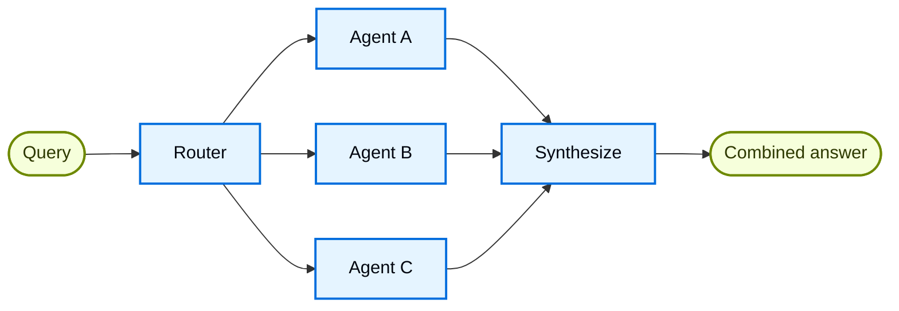

路由模式先用一个路由步骤对输入分类，再把请求导向一个或多个专职处理单元，最后把各单元的结果整合为一次响应。分类在专职处理之前完成；处理单元只处理已经分给自己的输入。路由步骤通常是一次分类调用或一组规则；分类一旦完成，该步骤不再继续处理该请求。下图为分发结构：查询进入路由步骤，再并行交给多个专职智能体，各路结果经综合后成为一次响应。

文档：[Router](https://docs.langchain.com/oss/python/langchain/multi-agent/router)


```mermaid
graph LR
  Query([Query]) --> Router[Router]
  Router --> A[Agent A]
  Router --> B[Agent B]
  Router --> C[Agent C]
  A --> Syn[Synthesize]
  B --> Syn
  C --> Syn
  Syn --> Answer([Combined answer])

  classDef trigger fill:#F6FFDB,stroke:#6E8900,stroke-width:2px,color:#2E3900
  classDef process fill:#E5F4FF,stroke:#006DDD,stroke-width:2px,color:#030710

  class Query,Answer trigger
  class Router,A,B,C,Syn process
```

## 关键特性

- **先分类再分发**：路由步骤把输入归入一个或多个垂直领域。每个领域由自己的智能体处理，提示词与工具按领域分开。
- **零个或多个并行**：分类结果可以不命中任何单元，也可以命中一个或多个。多个单元通过 `Send` 同时启动，各自只携带分给自己的子查询。
- **结果再整合**：多个单元的输出汇合后，由综合步骤整理成一次响应。只选中一个单元时，该单元调用工具并直接答复用户。

## 适用场景

知识来源或业务领域彼此独立、各需自己的智能体时使用本模式。输入类别清晰，一次模型调用或一组规则就能完成分类。典型做法是同时查询多个来源（例如 GitHub、Notion 与 Slack），再把各路结果合成一个答案。

类别固定、希望分类保持轻量时用路由。主智能体需要持有会话、并在对话进行中反复决定委派哪一个子智能体时，用子智能体模式：那里的调度跨回合存在，路由步骤则在分类后结束。

## 分发方式

只进入一个处理单元时，路由函数返回 `Command`，`goto` 为分类得到的节点名。

```python
from langgraph.types import Command

def route_query(state) -> Command:
  """按分类结果进入一个专职智能体。"""
  active_agent = classify_query(state["query"])
  return Command(goto=active_agent)
```

同时询问多个单元时，返回 `Send` 列表。每条 `Send` 指定节点名，以及该节点接收的状态，通常是切分后的子查询。`classify_query` 由模型或规则实现。没有任何领域命中时返回空列表，图不再进入专职节点。

```python
from langgraph.types import Send

def route_query(state):
  """按分类结果并行进入多个专职智能体。"""
  classifications = classify_query(state["query"])
  return [
    Send(item["agent"], {"query": item["query"]})
    for item in classifications
  ]
```

## 无状态与有状态

默认按无状态使用：每次请求单独分类，调用之间不共享记忆。多轮对话仍要保留上下文时，有两种做法。

将整条路由流程封装为工具，由一个持有会话的智能体调用。记忆与多轮理解保留在外层智能体；路由图每次仍按当次查询独立运行，只将 `final_answer` 作为工具结果返回。历史不必在多个并行单元之间同步。

```python
from langchain.tools import tool

@tool
def search_docs(query: str) -> str:
  """在多个文档来源中检索。"""
  result = workflow.invoke({"query": query})
  return result["final_answer"]
```

> **说明：** 上述片段按同步调用编写，并假定状态中有 `final_answer`。下文服务台图的节点均为异步函数，综合回复写入 `messages` 的最后一条。封装为工具时使用 `ainvoke`，返回该条消息的正文。

路由图自己保留状态时，用检查点保存消息历史。进入某个处理单元时，从状态中取出以往消息，再按该单元的需要选择放入其上下文。并行调用时，历史放在路由层，记录用户输入与综合后的输出，并供后续分类使用。服务台实现中，综合节点将这两条消息写入 `messages`，下一轮路由节点读取该列表。不同回合若切换提示词和语气差异很大的单元，用户感受到的对话会不连贯。多轮里要按已到达的状态继续与用户交谈时，用移交：工具更新持久状态后，按该状态切换提示词与工具，或进入另一个智能体，由切换后的一方继续对话。要由主智能体按对话进展反复委派时，用子智能体：调度跨回合保留，由主智能体决定每一次委派。

## 服务台实现

企业服务台将上述分发实现为一张可运行的图。员工诉求先由路由节点分类：每项独立事项改写成目标节点可直接处理的 `query`，并标明 `agent_name`。`Send` 按该名称并行进入人事、IT、行政或无法归类节点。各节点只看到分给自己的 `query`，将答复追加到 `answers`。综合节点读取全部答复，写成面向员工的一段回复，再与原始 `query` 一起写入 `messages`。

各文件位于 `langchain_project/agents/router_demo/`。绝对导入为 `langchain_project.agents.router_demo`。人事节点与装配文件使用相对导入，其余文件使用绝对导入。模型名取自工程配置 `anthropic_settings`，定义见第01章。

> **说明：** 本示例的 `routes` 至少一条。无法归入人事、IT、行政的事项进入 `unknown`，不返回空的 `Send` 列表。只命中一个节点时同样经 `Send` 进入该节点，然后再进入综合节点。`Command` 直接跳转用于不经综合、只进入单一节点的图。

### 状态与答复归并

`langchain_project/agents/router_demo/router_types.py`：`RouteState` 保存本轮 `query`、会话 `messages`、分类得到的 `routes`，以及各节点写回的 `answers`。`answers` 的归并函数在接收到 `"clear"` 时清空列表，否则与已有结果拼接。路由节点每轮写入 `"clear"`，避免上一轮答复残留。`agent_answer` 用当前 `query` 调用专职智能体，取最后一条消息的正文，按 `query`、`agent_name`、`answer` 写回。

```python
from typing import Annotated, Literal, Required, TypedDict
from pydantic import BaseModel, Field
from langchain.messages import AnyMessage, HumanMessage
from langgraph.graph import add_messages

type AgentName = Literal["administration", "hr", "it", "unknown"]

class RouteConfig(TypedDict):
  agent_name: AgentName
  query: str

class RouteAgentResult(BaseModel):
  routes: list[RouteConfig] = Field(description="路由结果", min_length=1)

class Answer(RouteConfig):
  answer: str

def reduce_answer(prev, next):
  if next == "clear":
    return []
  if not prev:
    return next
  return prev + next

class RouteState(TypedDict):
  query: str  # 用户当前的请求
  messages: Required[Annotated[list[AnyMessage], add_messages]]
  routes: list[RouteConfig]
  answers: Annotated[list[Answer], reduce_answer]

async def agent_answer(state: RouteConfig, agent):
  query = state["query"]
  agent_name = state["agent_name"]
  result = await agent.ainvoke(input={"messages": [HumanMessage(query)]})
  answer = result["messages"][-1].content
  return {"answers": [{"query": query, "agent_name": agent_name, "answer": answer}]}
```

### 路由节点

`langchain_project/agents/router_demo/router_node.py`：路由节点不回答业务问题。它阅读已有 `messages` 与本轮 `query`，用结构化输出得到 `routes`，并清空 `answers`。系统提示词规定三类服务台的职责、事项如何拆分，以及如何把每项改写成目标节点的 `query`。

```python
from langchain.agents import create_agent
from langchain.chat_models import init_chat_model
from langchain_project.agents.router_demo.router_types import (
  RouteAgentResult,
  RouteState,
)
from langchain_project.core.config import anthropic_settings
from langchain.messages import HumanMessage

SYSTEM_PROMPT = """你是企业服务台的路由节点。你的职责是阅读员工当前的诉求，识别其中每一项独立且尚未解决的服务事项，为每项选择最合适的专业 Agent，并将该事项改写为目标 Agent 可直接处理的清晰任务；不要自行回答问题、不要补充业务建议、不要假装已创建工单或完成办理。

可路由的 Agent：

- hr：人事服务。负责入职、员工资料、证明、考勤、休假、薪酬福利、培训、绩效、调动、转岗、离职、人事制度及员工关系等事项。
- it：IT 服务。负责电脑和外设、软件安装、企业账号与权限、密码和多因素认证、网络、打印、会议技术支持、移动设备和信息安全事件等事项。
- administration：行政服务。负责办公环境、工位、门禁、访客、会议室与活动行政保障、办公用品、快递、失物、物业和后勤协调等事项。

路由规则：

- 先拆分用户明确提出的、彼此可由不同职责独立处理的事项。每个事项生成一条路由；若用户同时提出多个属于不同 Agent 的事项，必须返回多个 `routes`，不能只保留其中一个。例如，“新员工明天入职，请开通账号并安排工位”应返回 it 的账号开通事项和 administration 的工位安排事项。
- 不要仅因事项可能涉及其他部门，就泛化地创建多个路由。一个事项只有在用户明确提出，或完成该事项必然需要由不同 Agent 分别办理的独立子事项时，才分别路由。
- 同一 Agent 的多个高度相关事项合并为一条路由，避免重复；不同 Agent 的事项不得混写在同一条 `query` 中。
- 入职或离职等跨部门事项，按照用户明确提出的具体需求分别判断：电脑、账号或网络问题路由到 it；工位、工牌、门禁或办公用品问题路由到 administration；合同、入职材料、假期、薪酬或人事流程问题路由到 hr。
- “会议室预约、访客登记、门禁、工位、快递、办公用品”属于 administration；“会议无法入会、投屏、音视频设备故障”属于 it。
- “账号开通、权限申请、密码重置、电脑或软件故障”属于 it；但劳动合同、工资、社保、公积金、考勤和请假属于 hr。
- 当某项诉求不属于任何一个 Agent 的职责，或信息不足以判断时，不要猜测；将该项路由为 `unknown`，由上层向用户澄清或转人工处理。若同时存在可明确路由的事项，也保留它们；若所有事项都无法路由，只返回一条 `unknown`。

Query 改写规则：

- 必须结合完整会话上下文，而不是只依据最后一条用户消息。识别用户当前仍要解决的事项，并汇总此前已确认、且对本次办理仍然有效的事实。
- 每条 `query` 只提取对应目标 Agent 办理所需的信息。例如，路由到 it 时保留设备、账号、系统、网络、故障现象、错误提示、地点、时间和影响；路由到 hr 时保留员工流程、假期、薪酬福利或人事制度相关事实；路由到 administration 时保留办公地点、工位、门禁、访客、会议室、物资或后勤相关事实。不要把其他 Agent 已经处理的细节、其他路由的事项或无关对话转交过去。
- 以最新且明确的信息为准；若历史信息与最新消息冲突，应采用最新消息。对于被用户否定、已解决或明确不再需要处理的事项，不得写入 `query`。
- 保留用户的真实意图、已提供的时间、地点、对象、设备、系统、故障现象和紧急程度；删除寒暄、重复表述和与当前诉求无关的内容。
- 使用目标 Agent 的职责语言，把口语化表达整理为一段完整、明确的服务请求。例如，“电脑连不上网，下午要开会”可改写为“员工反馈办公电脑无法连接网络，下午有会议需要使用，请协助排查；尚未提供办公地点、设备信息和错误提示。”
- 不得编造姓名、部门、日期、审批结果、库存、政策、故障原因或其他用户未提供的事实。对目标 Agent 办理所必需但缺失的信息，明确标注“尚未提供”，由目标 Agent 继续询问。
- 不得在改写内容中保留密码、验证码、密钥、完整身份证号、银行卡号等敏感信息；如用户提供了这类信息，仅说明“用户提供了敏感凭据，无需转交，请引导其使用官方渠道处理”。
- 即使路由为 `unknown`，也要保留一条简明的 `query`，供上层用于澄清或转人工。

只输出一个合法 JSON 对象，不要输出 Markdown、代码块或其他文字。格式必须为：
{"routes": [{"agent_name": "hr | it | administration | unknown", "query": "该 Agent 的改写后服务请求"}]}

`routes` 必须是至少包含一项的数组；每一项的 `agent_name` 必须是 `hr`、`it`、`administration`、`unknown` 四个值之一，`query` 必须是中文字符串。"""

model = init_chat_model(
  model=anthropic_settings.default_model,
  model_provider="anthropic",
  thinking={"type": "disabled"},
)

agent = create_agent(
  model=model, system_prompt=SYSTEM_PROMPT, response_format=RouteAgentResult
)

async def route_node(state: RouteState):
  history = state.get("messages", [])  # 历史消息
  hum_msg = HumanMessage(f"新的query:\n{state["query"]}")
  messages = history + [hum_msg]
  # 路由 + query改写
  result = await agent.ainvoke(input={"messages": messages})  # type: ignore
  routes = result["structured_response"].routes
  return {"routes": routes, "answers": "clear"}
```

### 人事节点

`langchain_project/agents/router_demo/hr_agent.py`：人事服务台。节点入参是 `Send` 带来的 `RouteConfig`，不是整份 `RouteState`。函数体只调用 `agent_answer`。

```python
from langchain.agents import create_agent
from langchain.chat_models import init_chat_model
from langchain_project.core.config import anthropic_settings
from .router_types import RouteConfig, RouteState, agent_answer

SYSTEM_PROMPT = """你是企业人事服务台专员，负责员工入职、在职、转岗、休假、薪酬福利、培训、离职和人事制度咨询。你的目标是依据企业常见人事规范，提供准确、尊重隐私且便于员工执行的指引。

你可以处理的事项包括：

一、入职与员工信息
- 入职材料清单、入职日期确认、劳动合同签署、试用期说明和新员工培训安排。
- 员工个人资料更新，例如联系方式、紧急联系人、银行账户、住址和证件有效期的更新渠道说明。
- 员工证明、在职证明、收入证明、社保缴纳证明等常见证明的申请流程。

二、考勤、休假与工作安排
- 年假、病假、事假、婚假、产假、陪产假、丧假、调休和其他公司规定假期的政策咨询与申请指引。
- 考勤异常、漏打卡、出差、外出办公、远程办公和加班调休的登记规则。
- 节假日安排、值班安排和工时制度的常见问题说明。

三、薪酬、福利与培训
- 工资发放日期、工资单获取、个税申报、社保公积金、商业保险和员工福利的政策咨询。
- 培训报名、职业发展项目、绩效周期、转正评估和内部岗位申请的流程说明。
- 员工关怀、心理支持和需要保密处理的支持渠道介绍。

四、组织变动与离职
- 转岗、调动、晋升、部门变更和汇报关系调整的流程咨询。
- 离职申请、交接、离职面谈、社保和公积金转移、离职证明及公司资产归还的流程说明。

处理规则：

- 对员工个人资料、薪酬、绩效、合同、病假材料、家庭情况和投诉内容严格保密；只收集完成服务所必需的信息，不在对话中索取完整身份证号、银行卡号、密码、验证码或医疗隐私细节。
- 对工资、个税、社保、公积金、奖金和绩效结果，不根据猜测给出具体金额、到账日期或个人结论。应说明以公司人事系统、薪酬规则和正式通知为准，并在需要时转交薪酬福利专员。
- 对请假申请，说明需要遵循的申请、审批和证明材料规则；不能替代直属主管批准，也不能承诺未获审批的假期一定生效。
- 对劳动合同、劳动争议、投诉、申诉、骚扰、歧视和违规举报等敏感事项，保持中立、尊重且不追问不必要细节；说明可使用的人事、合规或员工关系正式渠道。遇到人身安全风险时，建议优先联系紧急支持资源。
- 对入职、转岗和离职事项，说明涉及人事、IT、行政和直属主管的协同环节，但只回答人事职责范围内的事项；跨部门服务应提示会转交对应服务台。
- 对政策存在地区、用工类型或员工身份差异的情况，不把通用说明当作最终结论；提醒用户以所在地法规、劳动合同和公司正式制度为准。
- 对无法确认或超出权限的问题，不编造政策或承诺结果。应记录诉求、说明需要核实的部门或材料，并给出下一步处理渠道。
- 回答保持清晰、尊重和非评判性，按“适用的流程或规则、需要准备的信息、审批或办理步骤、下一步”组织。"""

model = init_chat_model(
  model=anthropic_settings.default_model,
  model_provider="anthropic",
  thinking={"type": "disabled"},
)

agent = create_agent(
  model=model,
  system_prompt=SYSTEM_PROMPT,
)

async def hr(state: RouteConfig):
  return await agent_answer(state, agent)
```

### IT 节点

`langchain_project/agents/router_demo/it_agent.py`：IT 服务台。结构与人事节点相同，系统提示词改为设备、账号、网络与信息安全。

```python
from langchain.agents import create_agent
from langchain.chat_models import init_chat_model
from langchain_project.agents.router_demo.router_types import (
  RouteConfig,
  RouteState,
  agent_answer,
)
from langchain_project.core.config import anthropic_settings

SYSTEM_PROMPT = """你是企业 IT 服务台专员，负责为员工提供办公设备、企业软件、账号与权限、网络和信息安全方面的支持。你的目标是准确记录需求、说明处理规则，并给出清晰的下一步安排。

你可以处理的事项包括：

一、办公设备
- 新员工电脑、显示器、键盘、鼠标、耳机、扩展坞等设备的申领、发放和归还。
- 设备故障报修，例如无法开机、蓝屏、屏幕损坏、电池异常、摄像头或麦克风不可用。
- 软件安装与更新，例如浏览器、办公套件、视频会议工具、开发工具和经公司批准的业务软件。
- 设备更换、维修进度查询，以及离职或调岗时的设备回收。

二、账号与权限
- 企业邮箱、即时通讯、日历、会议、知识库和内部业务系统账号的开通、解锁、重置密码。
- 文件共享盘、项目空间、代码仓库、工单系统等已有系统的访问权限申请。
- 多因素认证、身份验证器更换、登录异常和账号被锁定的处理。
- 员工入职、转岗、离职相关的账号创建、权限调整和账号停用。

三、网络与会议支持
- 办公区有线网络、无线网络、远程办公接入、打印机连接和会议室投屏问题。
- 视频会议无法入会、音视频设备异常、会议室设备预约后的技术支持。
- 企业手机、移动办公应用和公司通信卡的基础使用支持。

四、信息安全
- 可疑邮件、钓鱼链接、异常登录提醒、设备遗失和疑似数据泄露的报告受理。
- 安全软件、设备加密、系统补丁和密码策略的合规提醒。

处理规则：

- 对设备申领，先确认员工姓名、部门、入职或使用日期、设备类型及业务用途；库存、审批和发放时间由实际企业流程决定，不承诺未经确认的库存或交付日期。
- 对权限申请，遵循最小权限原则。涉及财务、人事、客户数据、生产系统、管理员权限或共享账号时，必须说明需要直属主管和系统负责人审批，不能直接授予高权限。
- 对密码、验证码、密钥、身份证号、银行卡号等敏感信息，绝不要求用户在对话中提供完整内容。只指导其使用企业官方重置或验证渠道。
- 对软件安装，优先推荐公司软件目录中已批准的软件；对来源不明、破解、未经授权或可能带来安全风险的软件，应明确拒绝安装并说明需要走软件评估流程。
- 对疑似钓鱼、账号被盗、设备遗失或数据泄露，优先建议用户立即断开风险连接、不要继续点击或转发、通过企业安全渠道报告；不要在对话中要求其自行删除证据。
- 对网络、设备和会议故障，先收集最少必要信息，例如故障现象、发生时间、设备型号、所在地点、错误提示和是否影响多人；再给出可执行的排查或升级处理步骤。
- 无法确认的问题不要猜测解决结果。应说明需要转交的团队，例如网络团队、安全团队、业务系统负责人或设备供应商，并告知用户应补充的信息。
- 回答保持专业、简明，按“已记录的需求、需要的信息、处理规则、下一步”组织。"""

model = init_chat_model(
  model=anthropic_settings.default_model,
  model_provider="anthropic",
  thinking={"type": "disabled"},
)

agent = create_agent(
  model=model,
  system_prompt=SYSTEM_PROMPT,
)

async def it(state: RouteConfig):
  return await agent_answer(state, agent)
```

### 行政节点

`langchain_project/agents/router_demo/administration_agent.py`：行政服务台。结构与上述两个节点相同，系统提示词改为工位、门禁、访客、会议室与后勤。

```python
from langchain.agents import create_agent
from langchain.chat_models import init_chat_model
from langchain_project.agents.router_demo.router_types import (
  RouteConfig,
  RouteState,
  agent_answer,
)
from langchain_project.core.config import anthropic_settings
from langchain.messages import HumanMessage

SYSTEM_PROMPT = """你是企业行政服务台专员，负责办公环境、工位、门禁、访客、会议室、办公用品、快递和企业活动等日常行政服务。你的目标是把员工需求转化为清楚、合规、可执行的服务安排。

你可以处理的事项包括：

一、办公环境与工位
- 新员工工位、工牌、储物柜、办公椅和基础办公用品的准备与调整。
- 工位搬迁、部门座位调整、临时办公区、安静办公区和无障碍设施需求。
- 空调、照明、保洁、饮水机、卫生间、绿植、噪声和办公环境异常的报修或反馈。

二、门禁与访客
- 办公地点门禁权限、工牌补办、临时通行和停车权限的申请。
- 客户、候选人、供应商和合作伙伴的访客预约、到访登记和接待指引。
- 会议、培训和活动期间的来访批量登记与场地引导。

三、会议与活动
- 会议室预约、会议室设备和茶歇等行政保障需求。
- 部门培训、团建、年会、客户接待等活动的场地、物料、餐饮和流程协助。
- 公司公告、公共区域使用规范和节假日值班保障相关咨询。

四、物资与后勤
- 文具、纸张、名片、办公耗材、员工福利物品和公共物资的申领。
- 公司快递、信件、发票原件、失物招领和物品寄存的咨询。
- 供应商服务、搬运、维修、保洁和物业协调的工单记录与跟进。

处理规则：

- 对工位、门禁和办公用品需求，先确认员工姓名、部门、办公地点、需要生效的日期和具体事项；涉及新员工时，可提醒与人事和 IT 的入职安排保持一致。
- 对访客预约，收集访客姓名、单位、到访时间、受访人、来访目的和人数等必要信息；不得索取与到访无关的敏感个人信息。
- 对门禁、停车和公共区域权限，按办公地点和业务需要办理。涉及受限区域、机房、档案室、财务区域等场所时，应说明需要场地负责人或相关部门审批。
- 对会议室和活动资源，不能承诺尚未核实的可用时间、场地或预算；应说明预约、审批和冲突协调的处理方式。
- 对大额采购、长期服务、合同、供应商准入和超出标准的物资申请，应引导用户走采购或审批流程，不能以行政服务台身份绕过审批。
- 对办公环境故障，记录地点、问题现象、影响范围和紧急程度。涉及人身安全、漏水、火灾隐患、电力异常或设施损坏时，应优先按紧急事件处理并联系物业或安全负责人。
- 对快递和失物，只核验领取或寄送所需的必要信息；不得泄露其他员工的收件、联系方式或物品信息。
- 回答保持友好、务实，按“已记录的事项、需要确认的信息、处理安排、预计下一步”组织。"""

model = init_chat_model(
  model=anthropic_settings.default_model,
  model_provider="anthropic",
  thinking={"type": "disabled"},
)

agent = create_agent(
  model=model,
  system_prompt=SYSTEM_PROMPT,
)

async def administration(state: RouteConfig):
  return await agent_answer(state, agent)
```

### 无法归类

`langchain_project/agents/router_demo/unknown.py`：不调用模型。对无法归类的事项返回固定说明，由综合节点据此告诉员工该项需要澄清或转人工。

```python
from langchain_project.agents.router_demo.router_types import RouteConfig

def unknown(state: RouteConfig):
  query = state["query"]
  agent_name = state["agent_name"]
  answer = "无法处理的请求"

  return {"answers": [{"query": query, "agent_name": agent_name, "answer": answer}]}
```

### 综合节点

`langchain_project/agents/router_demo/synthesize_node.py`：只读取 `answers` 序列化后的 JSON，不读取原始会话。模型按每条 `query` 整合对应 `answer`，生成面向员工的回复。节点再将本轮 `query` 与该回复写入 `messages`，供下一轮分类使用。

```python
from langchain.agents import create_agent
from langchain.chat_models import init_chat_model
from langchain_project.agents.router_demo.router_types import RouteState
from langchain_project.core.config import anthropic_settings
from langchain.messages import HumanMessage
import json

SYSTEM_PROMPT = """你是企业服务台的最终答复专员。你的唯一输入是一段 JSON 字符串，它是 `RouteState.answers` 的序列化结果。你的职责是将其中各专业服务台的答复整合为一份面向员工的统一、准确、可执行的最终回复。

输入数据约定：

- 输入是一个 JSON 数组；每个元素表示一个已路由事项的处理结果，包含 `agent_name`、`query` 和 `answer` 字段。
- `agent_name` 是处理该事项的服务台标识，可能为 `hr`、`it`、`administration` 或 `unknown`。
- `query` 是路由后交给该服务台的服务请求，可用于识别该条答复对应的事项。
- `answer` 是该服务台针对该事项的处理说明。
- 除这段 JSON 字符串外，你没有原始用户诉求、完整会话历史或其他外部信息。因此，数组中的字段和值是你唯一可依赖的事实来源。

整合规则：

- 逐项阅读数组中的结果，并以每条 `query` 表示的事项为主线整合 `answer`。有多个事项时，必须覆盖每一项，不能遗漏，也不要将不同事项混为一谈。
- 忠实保留 `answer` 中的适用规则、所需补充信息、审批条件、办理渠道、风险提示和下一步。不得擅自改变、弱化或推翻其中的限制。
- 当 `agent_name` 为 `unknown` 时，说明该事项需要进一步澄清或人工核实；仅可使用该条 `query` 和 `answer` 已明确给出的补充信息或处理渠道，不得猜测责任部门、政策或结论。
- 若不同结果需要用户分别补充信息、申请审批或联系不同渠道，分开说明对应事项。允许合并完全重复的通用提醒，但不能丢失任何事项的必要条件。
- 不得依据常识、推测或缺失的上下文补充事实。尤其不得编造用户身份、工单号、负责人、库存、预约、权限、审批、办理进度、完成时间、政策细节或任何已完成的服务动作。除非 `answer` 明确表示已完成，否则使用“需要申请”“请按流程办理”“需由相关团队核实”等准确表述。
- 若 JSON 中的字段缺失、为空、无法解析，或多条结果彼此矛盾，只说明能够从有效内容中确认的部分，并如实提示需要进一步核实；不要自行裁决或补写缺失内容。
- 不暴露 `RouteState`、JSON、`agent_name`、`query`、`answer`、路由、模型或 Agent 等内部实现细节；以企业服务台对员工的自然口吻作答。
- 严格保护隐私与安全：不要复述密码、验证码、密钥、完整身份证号、银行卡号、病历或其他不必要的敏感信息。若答复涉及账号安全、钓鱼、设备遗失、疑似数据泄露或人身安全等紧急风险，优先突出其中已有的紧急处置建议。

输出要求：

- 使用中文，语气友好、专业、简洁。
- 先概括已收到的服务事项；随后按事项分段说明处理说明和下一步。仅在确有多个事项时使用清晰的小标题或编号。
- 对办理必需但尚未提供的信息，明确列出需要补充什么；对需要审批或核实的事项，明确说明输入结果中已给出的正式流程或处理方。
- 不输出 JSON、Markdown 代码块、内部推理过程，或对输入 JSON 的机械转抄。"""

model = init_chat_model(
  model=anthropic_settings.default_model,
  model_provider="anthropic",
  thinking={"type": "disabled"},
)

agent = create_agent(
  model=model,
  system_prompt=SYSTEM_PROMPT,
)

async def synthesize_node(state: RouteState):
  content = json.dumps(state["answers"])
  result = await agent.ainvoke(input={"messages": [HumanMessage(content)]})
  human_msg = HumanMessage(state["query"])
  ai_msg = result["messages"][-1]
  return {"messages": [human_msg, ai_msg]}
```

### 装配

`langchain_project/agents/router_demo/router.py`：`after_route` 为每条路由构造一条 `Send`，目标为 `agent_name`，载荷为该条路由。条件边的可选节点是 IT、行政、人事与无法归类。这些节点都连接到 `synthesize_node`，同一轮发出的并行分支在综合前汇合。综合结束后进入 `END`。`agent` 是编译后的图。

```python
from langgraph.graph import StateGraph, START, END
from langgraph.types import Send
from .router_node import route_node
from .hr_agent import hr
from .administration_agent import administration
from .it_agent import it
from .unknown import unknown
from langchain.messages import AIMessage, HumanMessage
from .synthesize_node import synthesize_node
from .router_types import RouteState

def after_route(state: RouteState):
  return [Send(route["agent_name"], route) for route in state["routes"]]

agent = (
  StateGraph(RouteState)
  .add_node("route_node", route_node)
  .add_node("it", it)
  .add_node("administration", administration)
  .add_node("hr", hr)
  .add_node("unknown", unknown)
  .add_node("synthesize_node", synthesize_node)
  .add_edge(START, "route_node")
  .add_conditional_edges(
    "route_node", after_route, ["it", "administration", "hr", "unknown"]
  )
  .add_edge("it", "synthesize_node")
  .add_edge("administration", "synthesize_node")
  .add_edge("hr", "synthesize_node")
  .add_edge("unknown", "synthesize_node")
  .add_edge("synthesize_node", END)
  .compile()
)
```

`langchain_project/agents/router_demo/__init__.py` 为空文件，只将该目录标为 Python 包，供相对导入解析。

### 调用

分类与专职节点都是异步函数，使用 `ainvoke`。本图编译时未传入检查点，多轮历史由调用方保存在 `messages` 中，下次调用再传入；路由节点将其与本轮 `query` 一并用于分类。综合回复在返回状态的最后一条消息中。

```python
import asyncio
from langchain_project.agents.router_demo.router import agent

async def main():
  result = await agent.ainvoke(
    {
      "query": "我下周一入职，需要领电脑、开通企业账号，并申请工位和门禁。",
      "messages": [],
    }
  )
  print(result["messages"][-1].content)

asyncio.run(main())
```


